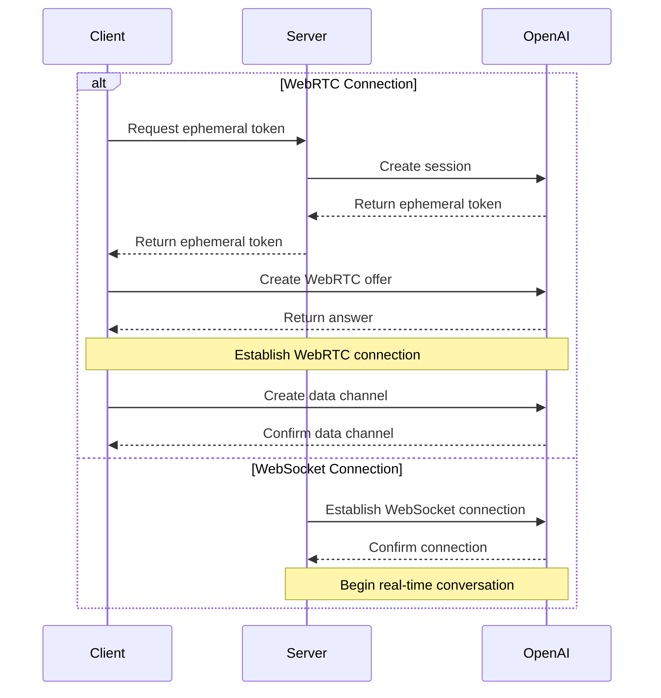

import { Callout } from 'fumadocs-ui/components/callout';

<Callout type="info" title="Official Documentation">
- [OpenAI Realtime WebRTC](https://platform.openai.com/docs/guides/realtime-webrtc)
- [OpenAI Realtime WebSocket](https://platform.openai.com/docs/guides/realtime-websocket)
</Callout>
## 📝 Overview

### Introduction
OpenAI Realtime API provides two connection methods:

1. WebRTC - For real-time audio/video interaction in browsers and mobile clients

2. WebSocket - For server-to-server application integration

### Use Cases
- Real-time voice conversations
- Audio/video conferencing
- Real-time translation
- Speech transcription
- Real-time code generation
- Server-side real-time integration

### Key Features
- Bidirectional audio streaming
- Mixed text and audio conversations
- Function calling support
- Automatic Voice Activity Detection (VAD)
- Audio transcription capabilities
- WebSocket server-side integration

## 🤖 Supported Models

Currently supported models include:

| Model | Description |
| --- | --- |
| **gpt-4o-realtime-preview** | GPT-4o Realtime model |
| **gpt-4o-realtime-preview-2024-12-17** | GPT-4o Realtime model (2024-12-17 version) |
| **gpt-4o-mini-realtime-preview** | GPT-4o Mini Realtime model |

## 🔐 Authentication & Security

### Authentication Methods
1. Standard API Key (server-side only)
2. Ephemeral Token (client-side use)

### Ephemeral Token
- Validity: 1 minute
- Usage limit: Single connection
- Generation: Created via server-side API

```http
POST ((SITE_URL))/v1/realtime/sessions
Content-Type: application/json
Authorization: Bearer $API_KEY

{
  "model": "gpt-4o-realtime-preview-2024-12-17",
  "voice": "verse"
}
```

### Security Recommendations
- Never expose standard API keys on the client side
- Use HTTPS/WSS for communication
- Implement appropriate access controls
- Monitor for unusual activity

## 🔌 Connection Establishment

### WebRTC Connection
- URL: `((SITE_URL))/v1/realtime`
- Query parameters: `model`
- Headers: 
  - `Authorization: Bearer EPHEMERAL_KEY`
  - `Content-Type: application/sdp`

### WebSocket Connection
- URL: `wss://((SITE_HOST))/v1/realtime`
- Query parameters: `model`
- Headers:
  - `Authorization: Bearer YOUR_API_KEY`
  - `OpenAI-Beta: realtime=v1`

### Connection Flow



### Data Channel
- Name: `oai-events`
- Purpose: Event transmission
- Format: JSON

### Audio Stream
- Input: `addTrack()`
- Output: `ontrack` event

## 💬 Conversation Interaction

### Conversation Modes
1. Text-only conversations
2. Voice conversations
3. Mixed conversations

### Session Management
- Create session
- Update session
- End session
- Session configuration

### Event Types
- Text events
- Audio events
- Function calls
- Status updates
- Error events

## ⚙️ Configuration Options

### Audio Configuration
- Input formats
  - `pcm16`
  - `g711_ulaw`
  - `g711_alaw`
- Output formats
  - `pcm16`
  - `g711_ulaw`
  - `g711_alaw`
- Voice types
  - `alloy`
  - `echo`
  - `shimmer`

### Model Configuration
- Temperature
- Maximum output length
- System prompt
- Tool configuration

### VAD Configuration
- Threshold
- Silence duration
- Prefix padding

## 💡 Request Examples

### WebSocket Connection ✅

<ExampleTabs items={["Node.js (ws module)","Python (websocket-client)","Browser (Standard WebSocket)","Message Send/Receive Example","WebSocket Python Audio Example"]}>
<ExampleTab id="request-example-1">

```javascript
import WebSocket from "ws";

const url = "wss://((SITE_HOST))/v1/realtime?model=gpt-4o-realtime-preview-2024-12-17";
const ws = new WebSocket(url, {
  headers: {
    "Authorization": "Bearer " + process.env.API_KEY,
    "OpenAI-Beta": "realtime=v1",
  },
});

ws.on("open", function open() {
  console.log("Connected to server.");
});

ws.on("message", function incoming(message) {
  console.log(JSON.parse(message.toString()));
});
```

</ExampleTab>

<ExampleTab id="request-example-2">

```python
# Requires websocket-client library:
# pip install websocket-client

import os
import json
import websocket

API_KEY = os.environ.get("API_KEY")

url = "wss://((SITE_HOST))/v1/realtime?model=gpt-4o-realtime-preview-2024-12-17"
headers = [
    "Authorization: Bearer " + API_KEY,
    "OpenAI-Beta: realtime=v1"
]

def on_open(ws):
    print("Connected to server.");

def on_message(ws, message):
    data = json.loads(message)
    print("Received event:", json.dumps(data, indent=2))

ws = websocket.WebSocketApp(
    url,
    header=headers,
    on_open=on_open,
    on_message=on_message,
)

ws.run_forever()
```

</ExampleTab>

<ExampleTab id="request-example-3">

```javascript
/*
Note: In browser and other client environments, we recommend using WebRTC.
But in Deno and Cloudflare Workers and other browser-like environments,
you can also use the standard WebSocket interface.
*/

const ws = new WebSocket(
  "wss://((SITE_HOST))/v1/realtime?model=gpt-4o-realtime-preview-2024-12-17",
  [
    "realtime",
    // Authentication
    "openai-insecure-api-key." + API_KEY, 
    // Optional
    "openai-organization." + OPENAI_ORG_ID,
    "openai-project." + OPENAI_PROJECT_ID,
    // Beta protocol, required
    "openai-beta.realtime-v1"
  ]
);

ws.on("open", function open() {
  console.log("Connected to server.");
});

ws.on("message", function incoming(message) {
  console.log(message.data);
});
```

</ExampleTab>

<ExampleTab id="request-example-4">


##### Node.js/Browser
```javascript
// Receive server events
ws.on("message", function incoming(message) {
  // Need to parse message data from JSON
  const serverEvent = JSON.parse(message.data)
  console.log(serverEvent);
});

// Send events, create JSON data structure conforming to client event format
const event = {
  type: "response.create",
  response: {
    modalities: ["audio", "text"],
    instructions: "Give me a haiku about code.",
  }
};
ws.send(JSON.stringify(event));
```

##### Python
```python
# Send client events, serialize dictionary to JSON
def on_open(ws):
    print("Connected to server.");
    
    event = {
        "type": "response.create",
        "response": {
            "modalities": ["text"],
            "instructions": "Please assist the user."
        }
    }
    ws.send(json.dumps(event))

# Receive messages need to parse message payload from JSON
def on_message(ws, message):
    data = json.loads(message)
    print("Received event:", json.dumps(data, indent=2))
```

</ExampleTab>

<ExampleTab id="request-example-5">


##### Example Documentation

This is a Python example of OpenAI Realtime WebSocket voice conversation, supporting real-time voice input and output.

###### Features

- 🎤 **Real-time Voice Recording**: Automatically detects voice input and sends it to the server
- 🔊 **Real-time Audio Playback**: Plays AI's voice responses
- 📝 **Text Display**: Simultaneously displays AI's text responses
- 🎯 **Automatic Voice Detection**: Uses server-side VAD (Voice Activity Detection)
- 🔄 **Bidirectional Communication**: Supports continuous conversation

###### Requirements

- Python 3.7+
- Microphone and speakers
- Stable network connection

###### Install Dependencies

```bash
pip install -r requirements.txt
```

System Dependencies:
On Linux systems, you may need to install additional audio libraries:

```bash
# Ubuntu/Debian
sudo apt-get install portaudio19-dev python3-pyaudio

# CentOS/RHEL
sudo yum install portaudio-devel
```

###### Configuration

In the `openai_realtime_client.py` file, ensure the following configuration is correct:

```python
WEBSOCKET_URL = "wss://((SITE_HOST))/v1/realtime"
API_KEY = "sk-QMA3eCob2EmDI2graXo4onUupApVnrk8wPXemJ7lSfK4QPa0"
MODEL = "gpt-4o-realtime-preview-2024-12-17"
```

###### Usage

1. **Run the program**:
   ```bash
   python openai_realtime_client.py
   ```

2. **Start conversation**:
   - The program will automatically start recording after launch
   - Speak into the microphone
   - AI will respond to your voice in real-time

3. **Stop the program**:
   - Press `Ctrl+C` to stop the program

###### Technical Details

Audio Configuration:
- **Sample Rate**: 24kHz (OpenAI Realtime API requirement)
- **Format**: PCM16
- **Channels**: Mono
- **Encoding**: Base64

WebSocket Message Types:
- `session.update`: Session configuration
- `input_audio_buffer.append`: Send audio data
- `input_audio_buffer.commit`: Commit audio buffer
- `response.audio.delta`: Receive audio response
- `response.text.delta`: Receive text response

Voice Activity Detection:
Uses server-side VAD configuration:
- Threshold: 0.5
- Prefix padding: 300ms
- Silence duration: 500ms

###### Troubleshooting

Common Issues:

1. **Audio Device Issues**:
   ```bash
   # Check audio devices
   python -c "import pyaudio; p = pyaudio.PyAudio(); print([p.get_device_info_by_index(i) for i in range(p.get_device_count())])"
   ```

2. **Permission Issues**:
   - Ensure the program has microphone access permissions
   - Linux: Check ALSA/PulseAudio configuration

3. **Network Connection Issues**:
   - Check if the WebSocket URL is correct
   - Ensure the API key is valid
   - Check firewall settings

Debug Mode:

Enable verbose logging:
```python
logging.basicConfig(level=logging.DEBUG)
```

###### Code Structure

```
├── openai_realtime_client.py  # Main program file
├── requirements.txt           # Python dependencies
└── README.md                  # Documentation
```

Main Classes and Methods:

- `OpenAIRealtimeClient`: Main client class
  - `connect()`: Connect to WebSocket
  - `start_audio_streams()`: Start audio streams
  - `start_recording()`: Start recording
  - `handle_response()`: Handle responses
  - `start_conversation()`: Start conversation

###### Notes

1. **Audio Quality**: Ensure use in a quiet environment for best results
2. **Network Latency**: Real-time conversation is sensitive to network latency
3. **Resource Usage**: Long-running sessions may consume significant CPU and memory
4. **API Limits**: Be aware of OpenAI API usage limits and costs

###### License

This project is for learning and testing purposes only. Please comply with OpenAI's terms of use.


##### Example Code
```python
#!/usr/bin/env python3
"""
OpenAI Realtime WebSocket Audio Example
Supports real-time voice conversation, including audio recording, sending, and playback
"""

import asyncio
import json
import base64
import websockets
import pyaudio
import wave
import threading
import time
from typing import Optional
import logging

# Configure logging
logging.basicConfig(
    level=logging.DEBUG,
    format='%(asctime)s - %(name)s - %(levelname)s - %(message)s',
    handlers=[
        logging.StreamHandler(),
        logging.FileHandler('websocket_debug.log', encoding='utf-8')
    ]
)
logger = logging.getLogger(__name__)

class OpenAIRealtimeClient:
    def __init__(self, 
                 websocket_url: str,
                 api_key: str,
                 model: str = "gpt-4o-realtime-preview-2024-12-17"):
        self.websocket_url = websocket_url
        self.api_key = api_key
        self.model = model
        self.websocket = None
        self.is_recording = False
        self.is_connected = False
        
        # Audio configuration
        self.audio_format = pyaudio.paInt16
        self.channels = 1
        self.rate = 24000  # OpenAI Realtime API required sample rate
        self.chunk = 1024
        self.audio = pyaudio.PyAudio()
        
        # Audio streams
        self.input_stream = None
        self.output_stream = None
        
    async def connect(self):
        """Connect to WebSocket server"""
        headers = {
            "Authorization": f"Bearer {self.api_key}",
            "OpenAI-Beta": "realtime=v1"
        }
        
        logger.info("=" * 80)
        logger.info("🚀 Starting WebSocket connection")
        logger.info("=" * 80)
        logger.info(f"Connection URL: {self.websocket_url}")
        logger.info(f"API Key: {self.api_key[:10]}...")
        logger.info(f"Headers: {json.dumps(headers, ensure_ascii=False, indent=2)}")
        
        try:
            self.websocket = await websockets.connect(
                self.websocket_url,
                additional_headers=headers
            )
            self.is_connected = True
            logger.info("✅ WebSocket connection successful")
            
            # Send session configuration
            await self.send_session_config()
            
        except Exception as e:
            logger.error(f"❌ WebSocket connection failed: {e}")
            logger.error(f"Error type: {type(e).__name__}")
            raise
    
    async def send_session_config(self):
        """Send session configuration"""
        config = {
            "type": "session.update",
            "session": {
                "modalities": ["text", "audio"],
                "instructions": "You are a helpful AI assistant that can engage in real-time voice conversations.",
                "voice": "alloy",
                "input_audio_format": "pcm16",
                "output_audio_format": "pcm16",
                "input_audio_transcription": {
                    "model": "whisper-1"
                },
                "turn_detection": {
                    "type": "server_vad",
                    "threshold": 0.5,
                    "prefix_padding_ms": 300,
                    "silence_duration_ms": 500
                },
                "tools": [],
                "tool_choice": "auto",
                "temperature": 0.8,
                "max_response_output_tokens": 4096
            }
        }
        
        config_json = json.dumps(config, ensure_ascii=False, indent=2)
        logger.info("=" * 60)
        logger.info("📤 Sending session configuration:")
        logger.info(f"Message type: {config['type']}")
        logger.info(f"Configuration content:\n{config_json}")
        logger.info("=" * 60)
        
        await self.websocket.send(json.dumps(config))
        logger.info("✅ Session configuration sent")
    
    def start_audio_streams(self):
        """Start audio input and output streams"""
        try:
            # Input stream (microphone)
            self.input_stream = self.audio.open(
                format=self.audio_format,
                channels=self.channels,
                rate=self.rate,
                input=True,
                frames_per_buffer=self.chunk
            )
            
            # Output stream (speakers)
            self.output_stream = self.audio.open(
                format=self.audio_format,
                channels=self.channels,
                rate=self.rate,
                output=True,
                frames_per_buffer=self.chunk
            )
            
            logger.info("Audio streams started")
            
        except Exception as e:
            logger.error(f"Failed to start audio streams: {e}")
            raise
    
    def stop_audio_streams(self):
        """Stop audio streams"""
        if self.input_stream:
            self.input_stream.stop_stream()
            self.input_stream.close()
            self.input_stream = None
            
        if self.output_stream:
            self.output_stream.stop_stream()
            self.output_stream.close()
            self.output_stream = None
            
        logger.info("Audio streams stopped")
    
    async def start_recording(self):
        """Start recording and send audio data"""
        self.is_recording = True
        logger.info("Starting recording...")
        
        try:
            while self.is_recording and self.is_connected:
                # Read audio data
                audio_data = self.input_stream.read(self.chunk, exception_on_overflow=False)
                
                # Encode audio data as base64
                audio_base64 = base64.b64encode(audio_data).decode('utf-8')
                
                # Send audio data
                message = {
                    "type": "input_audio_buffer.append",
                    "audio": audio_base64
                }
                
                # Log audio data sending (every 10 times to avoid excessive logging)
                if hasattr(self, '_audio_count'):
                    self._audio_count += 1
                else:
                    self._audio_count = 1
                
                if self._audio_count % 10 == 0:  # Log every 10 times
                    logger.debug(f"🎤 Sending audio data #{self._audio_count}: length={len(audio_base64)} characters")
                
                await self.websocket.send(json.dumps(message))
                
                # Brief delay to avoid excessive sending
                await asyncio.sleep(0.01)
                
        except Exception as e:
            logger.error(f"Error during recording: {e}")
        finally:
            logger.info("Recording stopped")
    
    async def stop_recording(self):
        """Stop recording"""
        self.is_recording = False
        
        # Send recording end signal
        if self.websocket and self.is_connected:
            message = {
                "type": "input_audio_buffer.commit"
            }
            
            logger.info("=" * 60)
            logger.info("📤 Sending recording end signal:")
            logger.info(f"Message type: {message['type']}")
            logger.info("=" * 60)
            
            await self.websocket.send(json.dumps(message))
            logger.info("✅ Recording end signal sent")
    
    async def handle_response(self):
        """Handle WebSocket responses"""
        try:
            async for message in self.websocket:
                data = json.loads(message)
                message_type = data.get("type", "unknown")
                
                # Log all received messages in detail
                logger.info("=" * 60)
                logger.info("📥 Received WebSocket message:")
                logger.info(f"Message type: {message_type}")
                
                # Handle different message types
                if message_type == "response.audio.delta":
                    # Handle audio response
                    audio_data = base64.b64decode(data.get("delta", ""))
                    logger.info(f"🎵 Audio data: length={len(audio_data)} bytes")
                    if audio_data and self.output_stream:
                        self.output_stream.write(audio_data)
                        logger.info("✅ Audio data played")
                
                elif message_type == "response.text.delta":
                    # Handle text response
                    text = data.get("delta", "")
                    logger.info(f"💬 Text delta: '{text}'")
                    if text:
                        print(f"AI: {text}", end="", flush=True)
                
                elif message_type == "response.text.done":
                    # Text response complete
                    logger.info("✅ Text response complete")
                    print("\n")
                
                elif message_type == "response.audio.done":
                    # Audio response complete
                    logger.info("✅ Audio response complete")
                
                elif message_type == "error":
                    # Handle errors
                    error_info = data.get('error', {})
                    logger.error("❌ Server error:")
                    logger.error(f"Error details: {json.dumps(error_info, ensure_ascii=False, indent=2)}")
                
                elif message_type == "session.created":
                    # Session created successfully
                    logger.info("✅ Session created")
                
                elif message_type == "session.updated":
                    # Session updated successfully
                    logger.info("✅ Session updated")
                
                elif message_type == "conversation.item.created":
                    # Conversation item created
                    logger.info("📝 Conversation item created")
                
                elif message_type == "conversation.item.input_audio_buffer.speech_started":
                    # Speech started
                    logger.info("🎤 Speech start detected")
                
                elif message_type == "conversation.item.input_audio_buffer.speech_stopped":
                    # Speech stopped
                    logger.info("🔇 Speech stop detected")
                
                elif message_type == "conversation.item.input_audio_buffer.committed":
                    # Audio buffer committed
                    logger.info("📤 Audio buffer committed")
                
                else:
                    # Other unknown message types
                    logger.info(f"❓ Unknown message type: {message_type}")
                
                # Log complete message content (except audio data, as it's too long)
                if message_type != "response.audio.delta":
                    logger.info(f"Complete message content:\n{json.dumps(data, ensure_ascii=False, indent=2)}")
                
                logger.info("=" * 60)
                    
        except websockets.exceptions.ConnectionClosed:
            logger.info("WebSocket connection closed")
            self.is_connected = False
        except Exception as e:
            logger.error(f"Error handling response: {e}")
            self.is_connected = False
    
    async def start_conversation(self):
        """Start conversation"""
        try:
            # Start audio streams
            self.start_audio_streams()
            
            # Create tasks
            response_task = asyncio.create_task(self.handle_response())
            recording_task = asyncio.create_task(self.start_recording())
            
            logger.info("Conversation started, press Ctrl+C to stop")
            
            # Wait for tasks to complete
            await asyncio.gather(response_task, recording_task)
            
        except KeyboardInterrupt:
            logger.info("Stop signal received")
        except Exception as e:
            logger.error(f"Error during conversation: {e}")
        finally:
            await self.cleanup()
    
    async def cleanup(self):
        """Clean up resources"""
        self.is_recording = False
        self.is_connected = False
        
        # Stop audio streams
        self.stop_audio_streams()
        
        # Close WebSocket connection
        if self.websocket:
            await self.websocket.close()
            logger.info("WebSocket connection closed")
        
        # Terminate PyAudio
        self.audio.terminate()
        logger.info("Resource cleanup complete")
    
    async def run(self):
        """Run client"""
        try:
            await self.connect()
            await self.start_conversation()
        except Exception as e:
            logger.error(f"Error running client: {e}")
        finally:
            await self.cleanup()


async def main():
    """Main function"""
    # Configuration parameters
    WEBSOCKET_URL = "wss://((SITE_HOST))/v1/realtime?model=gpt-4o-realtime-preview-2024-12-17"
    API_KEY = "sk-EpnduEXFxjAt0AF55W08WBmzqZHlv9f4tmCDWd9TcJqBwVjV"
    MODEL = "gpt-4o-realtime-preview-2024-12-17"
    
    # Create client
    client = OpenAIRealtimeClient(
        websocket_url=WEBSOCKET_URL,
        api_key=API_KEY,
        model=MODEL
    )
    
    # Run client
    await client.run()


if __name__ == "__main__":
    print("OpenAI Realtime WebSocket Audio Example")
    print("=" * 50)
    print("Features:")
    print("- Real-time voice conversation")
    print("- Automatic speech recognition")
    print("- Text and audio responses")
    print("- Press Ctrl+C to stop")
    print("=" * 50)
    
    try:
        asyncio.run(main())
    except KeyboardInterrupt:
        print("\nProgram stopped")
    except Exception as e:
        print(f"Program error: {e}")

```

</ExampleTab>

</ExampleTabs>

## ⚠️ Error Handling

### Common Errors
1. Connection errors
   - Network issues
   - Authentication failures
   - Configuration errors
2. Audio errors
   - Device permissions
   - Unsupported formats
   - Codec issues
3. Session errors
   - Token expiration
   - Session timeout
   - Concurrency limits

### Error Recovery
1. Automatic reconnection
2. Session recovery
3. Error retry
4. Graceful degradation

## 📝 Event Reference

### Common Request Headers

All events need to include the following request headers:

| Header | Type | Description | Example Value |
|--------|------|-------------|---------------|
| Authorization | String | Authentication token | Bearer $API_KEY |
| OpenAI-Beta | String | API version | realtime=v1 |

### Client Events

#### session.update

Update the default configuration for the session.

<ParameterTree>
  <ParameterField id="openai-realtime-table-event-id-1" name="event_id" type="String">

    Client-generated event identifier
    **Example Value/Optional Values:** event_123
  </ParameterField>
  <ParameterField id="openai-realtime-table-type-2" name="type" type="String">

    Event type
    **Example Value/Optional Values:** session.update
  </ParameterField>
  <ParameterField id="openai-realtime-table-modalities-3" name="modalities" type="String array">

    Modality types the model can respond with
    **Example Value/Optional Values:** ["text", "audio"]
  </ParameterField>
  <ParameterField id="openai-realtime-table-instructions-4" name="instructions" type="String">

    System instructions prepended to model calls
    **Example Value/Optional Values:** "Your knowledge cutoff is 2023-10..."
  </ParameterField>
  <ParameterField id="openai-realtime-table-voice-5" name="voice" type="String">

    Voice type used by the model
    **Example Value/Optional Values:** alloy, echo, shimmer
  </ParameterField>
  <ParameterField id="openai-realtime-table-input-audio-format-6" name="input_audio_format" type="String">

    Input audio format
    **Example Value/Optional Values:** pcm16, g711_ulaw, g711_alaw
  </ParameterField>
  <ParameterField id="openai-realtime-table-output-audio-format-7" name="output_audio_format" type="String">

    Output audio format
    **Example Value/Optional Values:** pcm16, g711_ulaw, g711_alaw
  </ParameterField>
  <ParameterField id="openai-realtime-nested-1-group-input-audio-transcription" name="input_audio_transcription" type="object">
    <ParameterChildren>
      <ParameterField id="openai-realtime-table-input-audio-transcription-model-8" name="model" type="String">

        Model used for transcription
        **Example Value/Optional Values:** whisper-1
      </ParameterField>
    </ParameterChildren>
  </ParameterField>
  <ParameterField id="openai-realtime-nested-1-group-turn-detection" name="turn_detection" type="object">
    <ParameterChildren>
      <ParameterField id="openai-realtime-table-turn-detection-type-9" name="type" type="String">

        Voice detection type
        **Example Value/Optional Values:** server_vad
      </ParameterField>
      <ParameterField id="openai-realtime-table-turn-detection-threshold-10" name="threshold" type="Number">

        VAD activation threshold (0.0-1.0)
        **Example Value/Optional Values:** 0.8
      </ParameterField>
      <ParameterField id="openai-realtime-table-turn-detection-prefix-padding-ms-11" name="prefix_padding_ms" type="Integer">

        Audio duration included before speech starts
        **Example Value/Optional Values:** 500
      </ParameterField>
      <ParameterField id="openai-realtime-table-turn-detection-silence-duration-ms-12" name="silence_duration_ms" type="Integer">

        Silence duration to detect speech stop
        **Example Value/Optional Values:** 1000
      </ParameterField>
    </ParameterChildren>
  </ParameterField>
  <ParameterField id="openai-realtime-table-tools-13" name="tools" type="Array">

    List of tools available to the model
    **Example Value/Optional Values:** []
  </ParameterField>
  <ParameterField id="openai-realtime-table-tool-choice-14" name="tool_choice" type="String">

    How the model chooses tools
    **Example Value/Optional Values:** auto/none/required
  </ParameterField>
  <ParameterField id="openai-realtime-table-temperature-15" name="temperature" type="Number">

    Model sampling temperature
    **Example Value/Optional Values:** 0.8
  </ParameterField>
  <ParameterField id="openai-realtime-table-max-output-tokens-16" name="max_output_tokens" type="String/Integer">

    Maximum tokens per response
    **Example Value/Optional Values:** "inf"/4096
  </ParameterField>
</ParameterTree>

#### input_audio_buffer.append

Append audio data to the input audio buffer.

<ParameterTree>
  <ParameterField id="openai-realtime-table-event-id-17" name="event_id" type="String">

    Client-generated event identifier
    **Example Value:** event_456
  </ParameterField>
  <ParameterField id="openai-realtime-table-type-18" name="type" type="String">

    Event type
    **Example Value:** input_audio_buffer.append
  </ParameterField>
  <ParameterField id="openai-realtime-table-audio-19" name="audio" type="String">

    Base64-encoded audio data
    **Example Value:** Base64EncodedAudioData
  </ParameterField>
</ParameterTree>

#### input_audio_buffer.commit

Commit the audio data in the buffer as a user message.

<ParameterTree>
  <ParameterField id="openai-realtime-table-event-id-20" name="event_id" type="String">

    Client-generated event identifier
    **Example Value:** event_789
  </ParameterField>
  <ParameterField id="openai-realtime-table-type-21" name="type" type="String">

    Event type
    **Example Value:** input_audio_buffer.commit
  </ParameterField>
</ParameterTree>

#### input_audio_buffer.clear

Clear all audio data from the input audio buffer.

<ParameterTree>
  <ParameterField id="openai-realtime-table-event-id-22" name="event_id" type="String">

    Client-generated event identifier
    **Example Value:** event_012
  </ParameterField>
  <ParameterField id="openai-realtime-table-type-23" name="type" type="String">

    Event type
    **Example Value:** input_audio_buffer.clear
  </ParameterField>
</ParameterTree>

#### conversation.item.create

Add a new conversation item to the conversation.

<ParameterTree>
  <ParameterField id="openai-realtime-table-event-id-24" name="event_id" type="String">

    Client-generated event identifier
    **Example Value:** event_345
  </ParameterField>
  <ParameterField id="openai-realtime-table-type-25" name="type" type="String">

    Event type
    **Example Value:** conversation.item.create
  </ParameterField>
  <ParameterField id="openai-realtime-table-previous-item-id-26" name="previous_item_id" type="String">

    New item will be inserted after this ID
    **Example Value:** null
  </ParameterField>
  <ParameterField id="openai-realtime-nested-5-group-item" name="item" type="object">
    <ParameterChildren>
      <ParameterField id="openai-realtime-table-item-id-27" name="id" type="String">

        Unique identifier for the conversation item
        **Example Value:** msg_001
      </ParameterField>
      <ParameterField id="openai-realtime-table-item-type-28" name="type" type="String">

        Type of conversation item
        **Example Value:** message/function_call/function_call_output
      </ParameterField>
      <ParameterField id="openai-realtime-table-item-status-29" name="status" type="String">

        Status of conversation item
        **Example Value:** completed/in_progress/incomplete
      </ParameterField>
      <ParameterField id="openai-realtime-table-item-role-30" name="role" type="String">

        Role of message sender
        **Example Value:** user/assistant/system
      </ParameterField>
      <ParameterField id="openai-realtime-table-item-content-31" name="content" type="Array">

        Message content
        **Example Value:** [text/audio/transcript]
      </ParameterField>
      <ParameterField id="openai-realtime-table-item-call-id-32" name="call_id" type="String">

        ID of function call
        **Example Value:** call_001
      </ParameterField>
      <ParameterField id="openai-realtime-table-item-name-33" name="name" type="String">

        Name of called function
        **Example Value:** function_name
      </ParameterField>
      <ParameterField id="openai-realtime-table-item-arguments-34" name="arguments" type="String">

        Arguments for function call
        **Example Value:** \{"param": "value"\}
      </ParameterField>
      <ParameterField id="openai-realtime-table-item-output-35" name="output" type="String">

        Output result of function call
        **Example Value:** \{"result": "value"\}
      </ParameterField>
    </ParameterChildren>
  </ParameterField>
</ParameterTree>

#### conversation.item.truncate

Truncate audio content in assistant messages.

<ParameterTree>
  <ParameterField id="openai-realtime-table-event-id-36" name="event_id" type="String">

    Client-generated event identifier
    **Example Value:** event_678
  </ParameterField>
  <ParameterField id="openai-realtime-table-type-37" name="type" type="String">

    Event type
    **Example Value:** conversation.item.truncate
  </ParameterField>
  <ParameterField id="openai-realtime-table-item-id-38" name="item_id" type="String">

    ID of assistant message item to truncate
    **Example Value:** msg_002
  </ParameterField>
  <ParameterField id="openai-realtime-table-content-index-39" name="content_index" type="Integer">

    Index of content part to truncate
    **Example Value:** 0
  </ParameterField>
  <ParameterField id="openai-realtime-table-audio-end-ms-40" name="audio_end_ms" type="Integer">

    End time point for audio truncation
    **Example Value:** 1500
  </ParameterField>
</ParameterTree>

#### conversation.item.delete

Delete the specified conversation item from conversation history.

<ParameterTree>
  <ParameterField id="openai-realtime-table-event-id-41" name="event_id" type="String">

    Client-generated event identifier
    **Example Value:** event_901
  </ParameterField>
  <ParameterField id="openai-realtime-table-type-42" name="type" type="String">

    Event type
    **Example Value:** conversation.item.delete
  </ParameterField>
  <ParameterField id="openai-realtime-table-item-id-43" name="item_id" type="String">

    ID of conversation item to delete
    **Example Value:** msg_003
  </ParameterField>
</ParameterTree>

#### response.create

Trigger response generation.

<ParameterTree>
  <ParameterField id="openai-realtime-table-event-id-44" name="event_id" type="String">

    Client-generated event identifier
    **Example Value:** event_234
  </ParameterField>
  <ParameterField id="openai-realtime-table-type-45" name="type" type="String">

    Event type
    **Example Value:** response.create
  </ParameterField>
  <ParameterField id="openai-realtime-nested-8-group-response" name="response" type="object">
    <ParameterChildren>
      <ParameterField id="openai-realtime-table-response-modalities-46" name="modalities" type="String array">

        Modality types for response
        **Example Value:** ["text", "audio"]
      </ParameterField>
      <ParameterField id="openai-realtime-table-response-instructions-47" name="instructions" type="String">

        Instructions for the model
        **Example Value:** "Please assist the user."
      </ParameterField>
      <ParameterField id="openai-realtime-table-response-voice-48" name="voice" type="String">

        Voice type used by the model
        **Example Value:** alloy/echo/shimmer
      </ParameterField>
      <ParameterField id="openai-realtime-table-response-output-audio-format-49" name="output_audio_format" type="String">

        Output audio format
        **Example Value:** pcm16
      </ParameterField>
      <ParameterField id="openai-realtime-table-response-tools-50" name="tools" type="Array">

        List of tools available to the model
        **Example Value:** ["type", "name", "description"]
      </ParameterField>
      <ParameterField id="openai-realtime-table-response-tool-choice-51" name="tool_choice" type="String">

        How the model chooses tools
        **Example Value:** auto
      </ParameterField>
      <ParameterField id="openai-realtime-table-response-temperature-52" name="temperature" type="Number">

        Sampling temperature
        **Example Value:** 0.7
      </ParameterField>
      <ParameterField id="openai-realtime-table-response-max-output-tokens-53" name="max_output_tokens" type="Integer/String">

        Maximum output tokens
        **Example Value:** 150/"inf"
      </ParameterField>
    </ParameterChildren>
  </ParameterField>
</ParameterTree>

#### response.cancel

Cancel ongoing response generation.

<ParameterTree>
  <ParameterField id="openai-realtime-table-event-id-54" name="event_id" type="String">

    Client-generated event identifier
    **Example Value:** event_567
  </ParameterField>
  <ParameterField id="openai-realtime-table-type-55" name="type" type="String">

    Event type
    **Example Value:** response.cancel
  </ParameterField>
</ParameterTree>

### Server Events

#### error

Event returned when an error occurs.

<ParameterTree>
  <ParameterField id="openai-realtime-table-event-id-56" name="event_id" type="String array">

    Unique identifier for server event
    **Example Value:** ["event_890"]
  </ParameterField>
  <ParameterField id="openai-realtime-table-type-57" name="type" type="String">

    Event type
    **Example Value:** error
  </ParameterField>
  <ParameterField id="openai-realtime-nested-10-group-error" name="error" type="object">
    <ParameterChildren>
      <ParameterField id="openai-realtime-table-error-type-58" name="type" type="String">

        Error type
        **Example Value:** invalid_request_error/server_error
      </ParameterField>
      <ParameterField id="openai-realtime-table-error-code-59" name="code" type="String">

        Error code
        **Example Value:** invalid_event
      </ParameterField>
      <ParameterField id="openai-realtime-table-error-message-60" name="message" type="String">

        Human-readable error message
        **Example Value:** "The 'type' field is missing."
      </ParameterField>
      <ParameterField id="openai-realtime-table-error-param-61" name="param" type="String">

        Parameter related to error
        **Example Value:** null
      </ParameterField>
      <ParameterField id="openai-realtime-table-error-event-id-62" name="event_id" type="String">

        ID of related event
        **Example Value:** event_567
      </ParameterField>
    </ParameterChildren>
  </ParameterField>
</ParameterTree>

#### conversation.item.input_audio_transcription.completed

Returned when input audio transcription is enabled and transcription succeeds.

<ParameterTree>
  <ParameterField id="openai-realtime-table-event-id-63" name="event_id" type="String">

    Unique identifier for server event
    **Example Value:** event_2122
  </ParameterField>
  <ParameterField id="openai-realtime-table-type-64" name="type" type="String">

    Event type
    **Example Value:** conversation.item.input_audio_transcription.completed
  </ParameterField>
  <ParameterField id="openai-realtime-table-item-id-65" name="item_id" type="String">

    ID of user message item
    **Example Value:** msg_003
  </ParameterField>
  <ParameterField id="openai-realtime-table-content-index-66" name="content_index" type="Integer">

    Index of content part containing audio
    **Example Value:** 0
  </ParameterField>
  <ParameterField id="openai-realtime-table-transcript-67" name="transcript" type="String">

    Transcribed text content
    **Example Value:** "Hello, how are you?"
  </ParameterField>
</ParameterTree>

#### conversation.item.input_audio_transcription.failed

Returned when input audio transcription is configured but transcription request for user message fails.

<ParameterTree>
  <ParameterField id="openai-realtime-table-event-id-68" name="event_id" type="String">

    Unique identifier for server event
    **Example Value:** event_2324
  </ParameterField>
  <ParameterField id="openai-realtime-table-type-69" name="type" type="String array">

    Event type
    **Example Value:** ["conversation.item.input_audio_transcription.failed"]
  </ParameterField>
  <ParameterField id="openai-realtime-table-item-id-70" name="item_id" type="String">

    ID of user message item
    **Example Value:** msg_003
  </ParameterField>
  <ParameterField id="openai-realtime-table-content-index-71" name="content_index" type="Integer">

    Index of content part containing audio
    **Example Value:** 0
  </ParameterField>
  <ParameterField id="openai-realtime-nested-12-group-error" name="error" type="object">
    <ParameterChildren>
      <ParameterField id="openai-realtime-table-error-type-72" name="type" type="String">

        Error type
        **Example Value:** transcription_error
      </ParameterField>
      <ParameterField id="openai-realtime-table-error-code-73" name="code" type="String">

        Error code
        **Example Value:** audio_unintelligible
      </ParameterField>
      <ParameterField id="openai-realtime-table-error-message-74" name="message" type="String">

        Human-readable error message
        **Example Value:** "The audio could not be transcribed."
      </ParameterField>
      <ParameterField id="openai-realtime-table-error-param-75" name="param" type="String">

        Parameter related to error
        **Example Value:** null
      </ParameterField>
    </ParameterChildren>
  </ParameterField>
</ParameterTree>

#### conversation.item.truncated

Returned when client truncates previous assistant audio message item.

<ParameterTree>
  <ParameterField id="openai-realtime-table-event-id-76" name="event_id" type="String">

    Unique identifier for server event
    **Example Value:** event_2526
  </ParameterField>
  <ParameterField id="openai-realtime-table-type-77" name="type" type="String">

    Event type
    **Example Value:** conversation.item.truncated
  </ParameterField>
  <ParameterField id="openai-realtime-table-item-id-78" name="item_id" type="String">

    ID of truncated assistant message item
    **Example Value:** msg_004
  </ParameterField>
  <ParameterField id="openai-realtime-table-content-index-79" name="content_index" type="Integer">

    Index of truncated content part
    **Example Value:** 0
  </ParameterField>
  <ParameterField id="openai-realtime-table-audio-end-ms-80" name="audio_end_ms" type="Integer">

    Time point when audio was truncated (milliseconds)
    **Example Value:** 1500
  </ParameterField>
</ParameterTree>

#### conversation.item.deleted

Returned when an item in the conversation is deleted.

<ParameterTree>
  <ParameterField id="openai-realtime-table-event-id-81" name="event_id" type="String">

    Unique identifier for server event
    **Example Value:** event_2728
  </ParameterField>
  <ParameterField id="openai-realtime-table-type-82" name="type" type="String">

    Event type
    **Example Value:** conversation.item.deleted
  </ParameterField>
  <ParameterField id="openai-realtime-table-item-id-83" name="item_id" type="String">

    ID of deleted conversation item
    **Example Value:** msg_005
  </ParameterField>
</ParameterTree>

#### input_audio_buffer.committed

Returned when audio buffer data is committed.

<ParameterTree>
  <ParameterField id="openai-realtime-table-event-id-84" name="event_id" type="String">

    Unique identifier for server event
    **Example Value:** event_1121
  </ParameterField>
  <ParameterField id="openai-realtime-table-type-85" name="type" type="String">

    Event type
    **Example Value:** input_audio_buffer.committed
  </ParameterField>
  <ParameterField id="openai-realtime-table-previous-item-id-86" name="previous_item_id" type="String">

    New conversation item will be inserted after this ID
    **Example Value:** msg_001
  </ParameterField>
  <ParameterField id="openai-realtime-table-item-id-87" name="item_id" type="String">

    ID of user message item to be created
    **Example Value:** msg_002
  </ParameterField>
</ParameterTree>

#### input_audio_buffer.cleared

Returned when client clears input audio buffer.

<ParameterTree>
  <ParameterField id="openai-realtime-table-event-id-88" name="event_id" type="String">

    Unique identifier for server event
    **Example Value:** event_1314
  </ParameterField>
  <ParameterField id="openai-realtime-table-type-89" name="type" type="String">

    Event type
    **Example Value:** input_audio_buffer.cleared
  </ParameterField>
</ParameterTree>

#### input_audio_buffer.speech_started

In server voice detection mode, returned when voice input is detected.

<ParameterTree>
  <ParameterField id="openai-realtime-table-event-id-90" name="event_id" type="String">

    Unique identifier for server event
    **Example Value:** event_1516
  </ParameterField>
  <ParameterField id="openai-realtime-table-type-91" name="type" type="String">

    Event type
    **Example Value:** input_audio_buffer.speech_started
  </ParameterField>
  <ParameterField id="openai-realtime-table-audio-start-ms-92" name="audio_start_ms" type="Integer">

    Milliseconds from session start to voice detection
    **Example Value:** 1000
  </ParameterField>
  <ParameterField id="openai-realtime-table-item-id-93" name="item_id" type="String">

    ID of user message item to be created when voice stops
    **Example Value:** msg_003
  </ParameterField>
</ParameterTree>

#### input_audio_buffer.speech_stopped

In server voice detection mode, returned when voice input stops.

<ParameterTree>
  <ParameterField id="openai-realtime-table-event-id-94" name="event_id" type="String">

    Unique identifier for server event
    **Example Value:** event_1718
  </ParameterField>
  <ParameterField id="openai-realtime-table-type-95" name="type" type="String">

    Event type
    **Example Value:** input_audio_buffer.speech_stopped
  </ParameterField>
  <ParameterField id="openai-realtime-table-audio-start-ms-96" name="audio_start_ms" type="Integer">

    Milliseconds from session start to voice stop detection
    **Example Value:** 2000
  </ParameterField>
  <ParameterField id="openai-realtime-table-item-id-97" name="item_id" type="String">

    ID of user message item to be created
    **Example Value:** msg_003
  </ParameterField>
</ParameterTree>

#### response.created

Returned when a new response is created.

<ParameterTree>
  <ParameterField id="openai-realtime-table-event-id-98" name="event_id" type="String">

    Unique identifier for server event
    **Example Value:** event_2930
  </ParameterField>
  <ParameterField id="openai-realtime-table-type-99" name="type" type="String">

    Event type
    **Example Value:** response.created
  </ParameterField>
  <ParameterField id="openai-realtime-nested-19-group-response" name="response" type="object">
    <ParameterChildren>
      <ParameterField id="openai-realtime-table-response-id-100" name="id" type="String">

        Unique identifier for response
        **Example Value:** resp_001
      </ParameterField>
      <ParameterField id="openai-realtime-table-response-object-101" name="object" type="String">

        Object type
        **Example Value:** realtime.response
      </ParameterField>
      <ParameterField id="openai-realtime-table-response-status-102" name="status" type="String">

        Status of response
        **Example Value:** in_progress
      </ParameterField>
      <ParameterField id="openai-realtime-table-response-status-details-103" name="status_details" type="Object">

        Additional details about status
        **Example Value:** null
      </ParameterField>
      <ParameterField id="openai-realtime-table-response-output-104" name="output" type="String array">

        List of output items generated by response
        **Example Value:** ["[]"]
      </ParameterField>
      <ParameterField id="openai-realtime-table-response-usage-105" name="usage" type="Object">

        Usage statistics for response
        **Example Value:** null
      </ParameterField>
    </ParameterChildren>
  </ParameterField>
</ParameterTree>

#### response.done

Returned when response streaming is complete.

<ParameterTree>
  <ParameterField id="openai-realtime-table-event-id-106" name="event_id" type="String">

    Unique identifier for server event
    **Example Value:** event_3132
  </ParameterField>
  <ParameterField id="openai-realtime-table-type-107" name="type" type="String">

    Event type
    **Example Value:** response.done
  </ParameterField>
  <ParameterField id="openai-realtime-nested-20-group-response" name="response" type="object">
    <ParameterChildren>
      <ParameterField id="openai-realtime-table-response-id-108" name="id" type="String">

        Unique identifier for response
        **Example Value:** resp_001
      </ParameterField>
      <ParameterField id="openai-realtime-table-response-object-109" name="object" type="String">

        Object type
        **Example Value:** realtime.response
      </ParameterField>
      <ParameterField id="openai-realtime-table-response-status-110" name="status" type="String">

        Final status of response
        **Example Value:** completed/cancelled/failed/incomplete
      </ParameterField>
      <ParameterField id="openai-realtime-table-response-status-details-111" name="status_details" type="Object">

        Additional details about status
        **Example Value:** null
      </ParameterField>
      <ParameterField id="openai-realtime-table-response-output-112" name="output" type="String array">

        List of output items generated by response
        **Example Value:** ["[...]"]
      </ParameterField>
      <ParameterField id="openai-realtime-nested-20-group-usage" name="usage" type="object">
        <ParameterChildren>
          <ParameterField id="openai-realtime-table-response-usage-total-tokens-113" name="total_tokens" type="Integer">

            Total tokens
            **Example Value:** 50
          </ParameterField>
          <ParameterField id="openai-realtime-table-response-usage-input-tokens-114" name="input_tokens" type="Integer">

            Input tokens
            **Example Value:** 20
          </ParameterField>
          <ParameterField id="openai-realtime-table-response-usage-output-tokens-115" name="output_tokens" type="Integer">

            Output tokens
            **Example Value:** 30
          </ParameterField>
        </ParameterChildren>
      </ParameterField>
    </ParameterChildren>
  </ParameterField>
</ParameterTree>

#### response.output_item.added

Returned when a new output item is created during response generation.

<ParameterTree>
  <ParameterField id="openai-realtime-table-event-id-116" name="event_id" type="String">

    Unique identifier for server event
    **Example Value:** event_3334
  </ParameterField>
  <ParameterField id="openai-realtime-table-type-117" name="type" type="String">

    Event type
    **Example Value:** response.output_item.added
  </ParameterField>
  <ParameterField id="openai-realtime-table-response-id-118" name="response_id" type="String">

    ID of response the output item belongs to
    **Example Value:** resp_001
  </ParameterField>
  <ParameterField id="openai-realtime-table-output-index-119" name="output_index" type="String">

    Index of output item in response
    **Example Value:** 0
  </ParameterField>
  <ParameterField id="openai-realtime-nested-21-group-item" name="item" type="object">
    <ParameterChildren>
      <ParameterField id="openai-realtime-table-item-id-120" name="id" type="String">

        Unique identifier for output item
        **Example Value:** msg_007
      </ParameterField>
      <ParameterField id="openai-realtime-table-item-object-121" name="object" type="String">

        Object type
        **Example Value:** realtime.item
      </ParameterField>
      <ParameterField id="openai-realtime-table-item-type-122" name="type" type="String">

        Type of output item
        **Example Value:** message/function_call/function_call_output
      </ParameterField>
      <ParameterField id="openai-realtime-table-item-status-123" name="status" type="String">

        Status of output item
        **Example Value:** in_progress/completed
      </ParameterField>
      <ParameterField id="openai-realtime-table-item-role-124" name="role" type="String">

        Role associated with output item
        **Example Value:** assistant
      </ParameterField>
      <ParameterField id="openai-realtime-table-item-content-125" name="content" type="Array">

        Content of output item
        **Example Value:** ["type", "text", "audio", "transcript"]
      </ParameterField>
    </ParameterChildren>
  </ParameterField>
</ParameterTree>

#### response.output_item.done

Returned when output item streaming is complete.

<ParameterTree>
  <ParameterField id="openai-realtime-table-event-id-126" name="event_id" type="String">

    Unique identifier for server event
    **Example Value:** event_3536
  </ParameterField>
  <ParameterField id="openai-realtime-table-type-127" name="type" type="String">

    Event type
    **Example Value:** response.output_item.done
  </ParameterField>
  <ParameterField id="openai-realtime-table-response-id-128" name="response_id" type="String">

    ID of response the output item belongs to
    **Example Value:** resp_001
  </ParameterField>
  <ParameterField id="openai-realtime-table-output-index-129" name="output_index" type="String">

    Index of output item in response
    **Example Value:** 0
  </ParameterField>
  <ParameterField id="openai-realtime-nested-22-group-item" name="item" type="object">
    <ParameterChildren>
      <ParameterField id="openai-realtime-table-item-id-130" name="id" type="String">

        Unique identifier for output item
        **Example Value:** msg_007
      </ParameterField>
      <ParameterField id="openai-realtime-table-item-object-131" name="object" type="String">

        Object type
        **Example Value:** realtime.item
      </ParameterField>
      <ParameterField id="openai-realtime-table-item-type-132" name="type" type="String">

        Type of output item
        **Example Value:** message/function_call/function_call_output
      </ParameterField>
      <ParameterField id="openai-realtime-table-item-status-133" name="status" type="String">

        Final status of output item
        **Example Value:** completed/incomplete
      </ParameterField>
      <ParameterField id="openai-realtime-table-item-role-134" name="role" type="String">

        Role associated with output item
        **Example Value:** assistant
      </ParameterField>
      <ParameterField id="openai-realtime-table-item-content-135" name="content" type="Array">

        Content of output item
        **Example Value:** ["type", "text", "audio", "transcript"]
      </ParameterField>
    </ParameterChildren>
  </ParameterField>
</ParameterTree>

#### response.content_part.added

Returned when a new content part is added to assistant message item during response generation.

<ParameterTree>
  <ParameterField id="openai-realtime-table-event-id-136" name="event_id" type="String">

    Unique identifier for server event
    **Example Value:** event_3738
  </ParameterField>
  <ParameterField id="openai-realtime-table-type-137" name="type" type="String">

    Event type
    **Example Value:** response.content_part.added
  </ParameterField>
  <ParameterField id="openai-realtime-table-response-id-138" name="response_id" type="String">

    ID of response
    **Example Value:** resp_001
  </ParameterField>
  <ParameterField id="openai-realtime-table-item-id-139" name="item_id" type="String">

    ID of message item to add content part to
    **Example Value:** msg_007
  </ParameterField>
  <ParameterField id="openai-realtime-table-output-index-140" name="output_index" type="Integer">

    Index of output item in response
    **Example Value:** 0
  </ParameterField>
  <ParameterField id="openai-realtime-table-content-index-141" name="content_index" type="Integer">

    Index of content part in message item content array
    **Example Value:** 0
  </ParameterField>
  <ParameterField id="openai-realtime-nested-23-group-part" name="part" type="object">
    <ParameterChildren>
      <ParameterField id="openai-realtime-table-part-type-142" name="type" type="String">

        Content type
        **Example Value:** text/audio
      </ParameterField>
      <ParameterField id="openai-realtime-table-part-text-143" name="text" type="String">

        Text content
        **Example Value:** "Hello"
      </ParameterField>
      <ParameterField id="openai-realtime-table-part-audio-144" name="audio" type="String">

        Base64-encoded audio data
        **Example Value:** "base64_encoded_audio_data"
      </ParameterField>
      <ParameterField id="openai-realtime-table-part-transcript-145" name="transcript" type="String">

        Transcribed text of audio
        **Example Value:** "Hello"
      </ParameterField>
    </ParameterChildren>
  </ParameterField>
</ParameterTree>

#### response.content_part.done

Returned when content part in assistant message item streaming is complete.

<ParameterTree>
  <ParameterField id="openai-realtime-table-event-id-146" name="event_id" type="String">

    Unique identifier for server event
    **Example Value:** event_3940
  </ParameterField>
  <ParameterField id="openai-realtime-table-type-147" name="type" type="String">

    Event type
    **Example Value:** response.content_part.done
  </ParameterField>
  <ParameterField id="openai-realtime-table-response-id-148" name="response_id" type="String">

    ID of response
    **Example Value:** resp_001
  </ParameterField>
  <ParameterField id="openai-realtime-table-item-id-149" name="item_id" type="String">

    ID of message item to add content part to
    **Example Value:** msg_007
  </ParameterField>
  <ParameterField id="openai-realtime-table-output-index-150" name="output_index" type="Integer">

    Index of output item in response
    **Example Value:** 0
  </ParameterField>
  <ParameterField id="openai-realtime-table-content-index-151" name="content_index" type="Integer">

    Index of content part in message item content array
    **Example Value:** 0
  </ParameterField>
  <ParameterField id="openai-realtime-nested-24-group-part" name="part" type="object">
    <ParameterChildren>
      <ParameterField id="openai-realtime-table-part-type-152" name="type" type="String">

        Content type
        **Example Value:** text/audio
      </ParameterField>
      <ParameterField id="openai-realtime-table-part-text-153" name="text" type="String">

        Text content
        **Example Value:** "Hello"
      </ParameterField>
      <ParameterField id="openai-realtime-table-part-audio-154" name="audio" type="String">

        Base64-encoded audio data
        **Example Value:** "base64_encoded_audio_data"
      </ParameterField>
      <ParameterField id="openai-realtime-table-part-transcript-155" name="transcript" type="String">

        Transcribed text of audio
        **Example Value:** "Hello"
      </ParameterField>
    </ParameterChildren>
  </ParameterField>
</ParameterTree>

#### response.text.delta

Returned when text value of "text" type content part is updated.

<ParameterTree>
  <ParameterField id="openai-realtime-table-event-id-156" name="event_id" type="String">

    Unique identifier for server event
    **Example Value:** event_4142
  </ParameterField>
  <ParameterField id="openai-realtime-table-type-157" name="type" type="String">

    Event type
    **Example Value:** response.text.delta
  </ParameterField>
  <ParameterField id="openai-realtime-table-response-id-158" name="response_id" type="String">

    ID of response
    **Example Value:** resp_001
  </ParameterField>
  <ParameterField id="openai-realtime-table-item-id-159" name="item_id" type="String">

    ID of message item
    **Example Value:** msg_007
  </ParameterField>
  <ParameterField id="openai-realtime-table-output-index-160" name="output_index" type="Integer">

    Index of output item in response
    **Example Value:** 0
  </ParameterField>
  <ParameterField id="openai-realtime-table-content-index-161" name="content_index" type="Integer">

    Index of content part in message item content array
    **Example Value:** 0
  </ParameterField>
  <ParameterField id="openai-realtime-table-delta-162" name="delta" type="String">

    Text delta update content
    **Example Value:** "Sure, I can h"
  </ParameterField>
</ParameterTree>

#### response.text.done

Returned when "text" type content part text streaming is complete.

<ParameterTree>
  <ParameterField id="openai-realtime-table-event-id-163" name="event_id" type="String">

    Unique identifier for server event
    **Example Value:** event_4344
  </ParameterField>
  <ParameterField id="openai-realtime-table-type-164" name="type" type="String">

    Event type
    **Example Value:** response.text.done
  </ParameterField>
  <ParameterField id="openai-realtime-table-response-id-165" name="response_id" type="String">

    ID of response
    **Example Value:** resp_001
  </ParameterField>
  <ParameterField id="openai-realtime-table-item-id-166" name="item_id" type="String">

    ID of message item
    **Example Value:** msg_007
  </ParameterField>
  <ParameterField id="openai-realtime-table-output-index-167" name="output_index" type="Integer">

    Index of output item in response
    **Example Value:** 0
  </ParameterField>
  <ParameterField id="openai-realtime-table-content-index-168" name="content_index" type="Integer">

    Index of content part in message item content array
    **Example Value:** 0
  </ParameterField>
  <ParameterField id="openai-realtime-table-delta-169" name="delta" type="String">

    Final complete text content
    **Example Value:** "Sure, I can help with that."
  </ParameterField>
</ParameterTree>

#### response.audio_transcript.delta

Returned when transcription content of model-generated audio output is updated.

<ParameterTree>
  <ParameterField id="openai-realtime-table-event-id-170" name="event_id" type="String">

    Unique identifier for server event
    **Example Value:** event_4546
  </ParameterField>
  <ParameterField id="openai-realtime-table-type-171" name="type" type="String">

    Event type
    **Example Value:** response.audio_transcript.delta
  </ParameterField>
  <ParameterField id="openai-realtime-table-response-id-172" name="response_id" type="String">

    ID of response
    **Example Value:** resp_001
  </ParameterField>
  <ParameterField id="openai-realtime-table-item-id-173" name="item_id" type="String">

    ID of message item
    **Example Value:** msg_008
  </ParameterField>
  <ParameterField id="openai-realtime-table-output-index-174" name="output_index" type="Integer">

    Index of output item in response
    **Example Value:** 0
  </ParameterField>
  <ParameterField id="openai-realtime-table-content-index-175" name="content_index" type="Integer">

    Index of content part in message item content array
    **Example Value:** 0
  </ParameterField>
  <ParameterField id="openai-realtime-table-delta-176" name="delta" type="String">

    Transcription text delta update content
    **Example Value:** "Hello, how can I a"
  </ParameterField>
</ParameterTree>

#### response.audio_transcript.done

Returned when transcription of model-generated audio output streaming is complete.

<ParameterTree>
  <ParameterField id="openai-realtime-table-event-id-177" name="event_id" type="String">

    Unique identifier for server event
    **Example Value:** event_4748
  </ParameterField>
  <ParameterField id="openai-realtime-table-type-178" name="type" type="String">

    Event type
    **Example Value:** response.audio_transcript.done
  </ParameterField>
  <ParameterField id="openai-realtime-table-response-id-179" name="response_id" type="String">

    ID of response
    **Example Value:** resp_001
  </ParameterField>
  <ParameterField id="openai-realtime-table-item-id-180" name="item_id" type="String">

    ID of message item
    **Example Value:** msg_008
  </ParameterField>
  <ParameterField id="openai-realtime-table-output-index-181" name="output_index" type="Integer">

    Index of output item in response
    **Example Value:** 0
  </ParameterField>
  <ParameterField id="openai-realtime-table-content-index-182" name="content_index" type="Integer">

    Index of content part in message item content array
    **Example Value:** 0
  </ParameterField>
  <ParameterField id="openai-realtime-table-transcript-183" name="transcript" type="String">

    Final complete transcribed text of audio
    **Example Value:** "Hello, how can I assist you today?"
  </ParameterField>
</ParameterTree>

#### response.audio.delta

Returned when model-generated audio content is updated.

<ParameterTree>
  <ParameterField id="openai-realtime-table-event-id-184" name="event_id" type="String">

    Unique identifier for server event
    **Example Value:** event_4950
  </ParameterField>
  <ParameterField id="openai-realtime-table-type-185" name="type" type="String">

    Event type
    **Example Value:** response.audio.delta
  </ParameterField>
  <ParameterField id="openai-realtime-table-response-id-186" name="response_id" type="String">

    ID of response
    **Example Value:** resp_001
  </ParameterField>
  <ParameterField id="openai-realtime-table-item-id-187" name="item_id" type="String">

    ID of message item
    **Example Value:** msg_008
  </ParameterField>
  <ParameterField id="openai-realtime-table-output-index-188" name="output_index" type="Integer">

    Index of output item in response
    **Example Value:** 0
  </ParameterField>
  <ParameterField id="openai-realtime-table-content-index-189" name="content_index" type="Integer">

    Index of content part in message item content array
    **Example Value:** 0
  </ParameterField>
  <ParameterField id="openai-realtime-table-delta-190" name="delta" type="String">

    Base64-encoded audio data delta
    **Example Value:** "Base64EncodedAudioDelta"
  </ParameterField>
</ParameterTree>

#### response.audio.done

Returned when model-generated audio is complete.

<ParameterTree>
  <ParameterField id="openai-realtime-table-event-id-191" name="event_id" type="String">

    Unique identifier for server event
    **Example Value:** event_5152
  </ParameterField>
  <ParameterField id="openai-realtime-table-type-192" name="type" type="String">

    Event type
    **Example Value:** response.audio.done
  </ParameterField>
  <ParameterField id="openai-realtime-table-response-id-193" name="response_id" type="String">

    ID of response
    **Example Value:** resp_001
  </ParameterField>
  <ParameterField id="openai-realtime-table-item-id-194" name="item_id" type="String">

    ID of message item
    **Example Value:** msg_008
  </ParameterField>
  <ParameterField id="openai-realtime-table-output-index-195" name="output_index" type="Integer">

    Index of output item in response
    **Example Value:** 0
  </ParameterField>
  <ParameterField id="openai-realtime-table-content-index-196" name="content_index" type="Integer">

    Index of content part in message item content array
    **Example Value:** 0
  </ParameterField>
</ParameterTree>

### Function Calling

#### response.function_call_arguments.delta

Returned when model-generated function call arguments are updated.

<ParameterTree>
  <ParameterField id="openai-realtime-table-event-id-197" name="event_id" type="String">

    Unique identifier for server event
    **Example Value:** event_5354
  </ParameterField>
  <ParameterField id="openai-realtime-table-type-198" name="type" type="String">

    Event type
    **Example Value:** response.function_call_arguments.delta
  </ParameterField>
  <ParameterField id="openai-realtime-table-response-id-199" name="response_id" type="String">

    ID of response
    **Example Value:** resp_002
  </ParameterField>
  <ParameterField id="openai-realtime-table-item-id-200" name="item_id" type="String">

    ID of message item
    **Example Value:** fc_001
  </ParameterField>
  <ParameterField id="openai-realtime-table-output-index-201" name="output_index" type="Integer">

    Index of output item in response
    **Example Value:** 0
  </ParameterField>
  <ParameterField id="openai-realtime-table-call-id-202" name="call_id" type="String">

    ID of function call
    **Example Value:** call_001
  </ParameterField>
  <ParameterField id="openai-realtime-table-delta-203" name="delta" type="String">

    JSON format function call arguments delta
    **Example Value:** "\{\"location\": \"San\""
  </ParameterField>
</ParameterTree>

#### response.function_call_arguments.done

Returned when model-generated function call arguments streaming is complete.

<ParameterTree>
  <ParameterField id="openai-realtime-table-event-id-204" name="event_id" type="String">

    Unique identifier for server event
    **Example Value:** event_5556
  </ParameterField>
  <ParameterField id="openai-realtime-table-type-205" name="type" type="String">

    Event type
    **Example Value:** response.function_call_arguments.done
  </ParameterField>
  <ParameterField id="openai-realtime-table-response-id-206" name="response_id" type="String">

    ID of response
    **Example Value:** resp_002
  </ParameterField>
  <ParameterField id="openai-realtime-table-item-id-207" name="item_id" type="String">

    ID of message item
    **Example Value:** fc_001
  </ParameterField>
  <ParameterField id="openai-realtime-table-output-index-208" name="output_index" type="Integer">

    Index of output item in response
    **Example Value:** 0
  </ParameterField>
  <ParameterField id="openai-realtime-table-call-id-209" name="call_id" type="String">

    ID of function call
    **Example Value:** call_001
  </ParameterField>
  <ParameterField id="openai-realtime-table-arguments-210" name="arguments" type="String">

    Final complete function call arguments (JSON format)
    **Example Value:** "\{\"location\": \"San Francisco\"\}"
  </ParameterField>
</ParameterTree>

### Other Status Updates

#### rate_limits.updated

Triggered after each "response.done" event to indicate updated rate limits.

<ParameterTree>
  <ParameterField id="openai-realtime-table-event-id-211" name="event_id" type="String">

    Unique identifier for server event
    **Example Value:** event_5758
  </ParameterField>
  <ParameterField id="openai-realtime-table-type-212" name="type" type="String">

    Event type
    **Example Value:** rate_limits.updated
  </ParameterField>
  <ParameterField id="openai-realtime-table-rate-limits-213" name="rate_limits" type="Object array">

    List of rate limit information
    **Example Value:** [\{"name": "requests_per_min", "limit": 60, "remaining": 45, "reset_seconds": 35\}]
  </ParameterField>
</ParameterTree>

#### conversation.created

Returned when conversation is created.

<ParameterTree>
  <ParameterField id="openai-realtime-table-event-id-214" name="event_id" type="String">

    Unique identifier for server event
    **Example Value:** event_9101
  </ParameterField>
  <ParameterField id="openai-realtime-table-type-215" name="type" type="String">

    Event type
    **Example Value:** conversation.created
  </ParameterField>
  <ParameterField id="openai-realtime-table-conversation-216" name="conversation" type="Object">

    Conversation resource object
    **Example Value:** \{"id": "conv_001", "object": "realtime.conversation"\}
  </ParameterField>
</ParameterTree>

#### conversation.item.created

Returned when conversation item is created.

<ParameterTree>
  <ParameterField id="openai-realtime-table-event-id-217" name="event_id" type="String">

    Unique identifier for server event
    **Example Value:** event_1920
  </ParameterField>
  <ParameterField id="openai-realtime-table-type-218" name="type" type="String">

    Event type
    **Example Value:** conversation.item.created
  </ParameterField>
  <ParameterField id="openai-realtime-table-previous-item-id-219" name="previous_item_id" type="String">

    ID of previous conversation item
    **Example Value:** msg_002
  </ParameterField>
  <ParameterField id="openai-realtime-table-item-220" name="item" type="Object">

    Conversation item object
    **Example Value:** \{"id": "msg_003", "object": "realtime.item", "type": "message", "status": "completed", "role": "user", "content": [\{"type": "text", "text": "Hello"\}]\}
  </ParameterField>
</ParameterTree>

#### session.created

Returned when session is created.

<ParameterTree>
  <ParameterField id="openai-realtime-table-event-id-221" name="event_id" type="String">

    Unique identifier for server event
    **Example Value:** event_1234
  </ParameterField>
  <ParameterField id="openai-realtime-table-type-222" name="type" type="String">

    Event type
    **Example Value:** session.created
  </ParameterField>
  <ParameterField id="openai-realtime-table-session-223" name="session" type="Object">

    Session object
    **Example Value:** \{"id": "sess_001", "object": "realtime.session", "model": "gpt-4", "modalities": ["text", "audio"]\}
  </ParameterField>
</ParameterTree>

#### session.updated

Returned when session is updated.

<ParameterTree>
  <ParameterField id="openai-realtime-table-event-id-224" name="event_id" type="String">

    Unique identifier for server event
    **Example Value:** event_5678
  </ParameterField>
  <ParameterField id="openai-realtime-table-type-225" name="type" type="String">

    Event type
    **Example Value:** session.updated
  </ParameterField>
  <ParameterField id="openai-realtime-table-session-226" name="session" type="Object">

    Updated session object
    **Example Value:** \{"id": "sess_001", "object": "realtime.session", "model": "gpt-4", "modalities": ["text", "audio"]\}
  </ParameterField>
</ParameterTree>

### Rate Limit Event Parameter Table

<ParameterTree>
  <ParameterField id="openai-realtime-table-name-227" name="name" type="String" required>

    Limit name
    **Example Value:** requests_per_min
  </ParameterField>
  <ParameterField id="openai-realtime-table-limit-228" name="limit" type="Integer" required>

    Limit value
    **Example Value:** 60
  </ParameterField>
  <ParameterField id="openai-realtime-table-remaining-229" name="remaining" type="Integer" required>

    Remaining available amount
    **Example Value:** 45
  </ParameterField>
  <ParameterField id="openai-realtime-table-reset-seconds-230" name="reset_seconds" type="Integer" required>

    Reset time (seconds)
    **Example Value:** 35
  </ParameterField>
</ParameterTree>

### Function Call Parameter Table

<ParameterTree>
  <ParameterField id="openai-realtime-table-type-231" name="type" type="String" required>

    Function type
    **Example Value:** function
  </ParameterField>
  <ParameterField id="openai-realtime-table-name-232" name="name" type="String" required>

    Function name
    **Example Value:** get_weather
  </ParameterField>
  <ParameterField id="openai-realtime-table-description-233" name="description" type="String">

    Function description
    **Example Value:** Get the current weather
  </ParameterField>
  <ParameterField id="openai-realtime-table-parameters-234" name="parameters" type="Object" required>

    Function parameter definition
    **Example Value:** \{"type": "object", "properties": \{...\}\}
  </ParameterField>
</ParameterTree>

### Audio Format Parameter Table

<ParameterTree>
  <ParameterField id="openai-realtime-table-sample-rate-235" name="sample_rate" type="Integer">

    Sample rate
    **Optional Values:** 8000, 16000, 24000, 44100, 48000
  </ParameterField>
  <ParameterField id="openai-realtime-table-channels-236" name="channels" type="Integer">

    Number of channels
    **Optional Values:** 1 (mono), 2 (stereo)
  </ParameterField>
  <ParameterField id="openai-realtime-table-bits-per-sample-237" name="bits_per_sample" type="Integer">

    Bits per sample
    **Optional Values:** 16 (pcm16), 8 (g711)
  </ParameterField>
  <ParameterField id="openai-realtime-table-encoding-238" name="encoding" type="String">

    Encoding method
    **Optional Values:** pcm16, g711_ulaw, g711_alaw
  </ParameterField>
</ParameterTree>

### Voice Detection Parameter Table

<ParameterTree>
  <ParameterField id="openai-realtime-table-threshold-239" name="threshold" type="Float">

    VAD activation threshold
    **Default Value:** 0.5
    **Range:** 0.0-1.0
  </ParameterField>
  <ParameterField id="openai-realtime-table-prefix-padding-ms-240" name="prefix_padding_ms" type="Integer">

    Voice prefix padding (milliseconds)
    **Default Value:** 500
    **Range:** 0-5000
  </ParameterField>
  <ParameterField id="openai-realtime-table-silence-duration-ms-241" name="silence_duration_ms" type="Integer">

    Silence detection duration (milliseconds)
    **Default Value:** 1000
    **Range:** 100-10000
  </ParameterField>
</ParameterTree>

### Tool Selection Parameter Table

<ParameterTree>
  <ParameterField id="openai-realtime-table-tool-choice-242" name="tool_choice" type="String">

    Tool selection method
    **Optional Values:** auto, none, required
  </ParameterField>
  <ParameterField id="openai-realtime-table-tools-243" name="tools" type="Array">

    Available tools list
    **Optional Values:** [\{type, name, description, parameters\}]
  </ParameterField>
</ParameterTree>

### Model Configuration Parameter Table

<ParameterTree>
  <ParameterField id="openai-realtime-table-temperature-244" name="temperature" type="Float">

    Sampling temperature
    **Range/Optional Values:** 0.0-2.0
    **Default Value:** 1.0
  </ParameterField>
  <ParameterField id="openai-realtime-table-max-output-tokens-245" name="max_output_tokens" type="Integer/String">

    Maximum output length
    **Range/Optional Values:** 1-4096/"inf"
    **Default Value:** "inf"
  </ParameterField>
  <ParameterField id="openai-realtime-table-modalities-246" name="modalities" type="String array">

    Response modalities
    **Range/Optional Values:** ["text", "audio"]
    **Default Value:** ["text"]
  </ParameterField>
  <ParameterField id="openai-realtime-table-voice-247" name="voice" type="String">

    Voice type
    **Range/Optional Values:** alloy, echo, shimmer
    **Default Value:** alloy
  </ParameterField>
</ParameterTree>

### Event Common Parameter Table

<ParameterTree>
  <ParameterField id="openai-realtime-table-event-id-248" name="event_id" type="String" required>

    Unique identifier for event
    **Example Value:** event_123
  </ParameterField>
  <ParameterField id="openai-realtime-table-type-249" name="type" type="String" required>

    Event type
    **Example Value:** session.update
  </ParameterField>
  <ParameterField id="openai-realtime-table-timestamp-250" name="timestamp" type="Integer">

    Event timestamp (milliseconds)
    **Example Value:** 1677649363000
  </ParameterField>
</ParameterTree>

### Session Status Parameter Table

<ParameterTree>
  <ParameterField id="openai-realtime-table-status-251" name="status" type="String">

    Session status
    **Optional Values:** active, ended, error
  </ParameterField>
  <ParameterField id="openai-realtime-table-error-252" name="error" type="Object">

    Error information
    **Optional Values:** \{"type": "error_type", "message": "error message"\}
  </ParameterField>
  <ParameterField id="openai-realtime-table-metadata-253" name="metadata" type="Object">

    Session metadata
    **Optional Values:** \{"client_id": "web", "session_type": "chat"\}
  </ParameterField>
</ParameterTree>

### Conversation Item Status Parameter Table

<ParameterTree>
  <ParameterField id="openai-realtime-table-status-254" name="status" type="String">

    Conversation item status
    **Optional Values:** completed, in_progress, incomplete
  </ParameterField>
  <ParameterField id="openai-realtime-table-role-255" name="role" type="String">

    Sender role
    **Optional Values:** user, assistant, system
  </ParameterField>
  <ParameterField id="openai-realtime-table-type-256" name="type" type="String">

    Conversation item type
    **Optional Values:** message, function_call, function_call_output
  </ParameterField>
</ParameterTree>

### Content Type Parameter Table

<ParameterTree>
  <ParameterField id="openai-realtime-table-type-257" name="type" type="String">

    Content type
    **Optional Values:** text, audio, transcript
  </ParameterField>
  <ParameterField id="openai-realtime-table-format-258" name="format" type="String">

    Content format
    **Optional Values:** plain, markdown, html
  </ParameterField>
  <ParameterField id="openai-realtime-table-encoding-259" name="encoding" type="String">

    Encoding method
    **Optional Values:** utf-8, base64
  </ParameterField>
</ParameterTree>

### Response Status Parameter Table

<ParameterTree>
  <ParameterField id="openai-realtime-table-status-260" name="status" type="String">

    Response status
    **Optional Values:** completed, cancelled, failed, incomplete
  </ParameterField>
  <ParameterField id="openai-realtime-table-status-details-261" name="status_details" type="Object">

    Status details
    **Optional Values:** \{"reason": "user_cancelled"\}
  </ParameterField>
  <ParameterField id="openai-realtime-table-usage-262" name="usage" type="Object">

    Usage statistics
    **Optional Values:** \{"total_tokens": 50, "input_tokens": 20, "output_tokens": 30\}
  </ParameterField>
</ParameterTree>

### Audio Transcription Parameter Table

<ParameterTree>
  <ParameterField id="openai-realtime-table-enabled-263" name="enabled" type="Boolean">

    Whether transcription is enabled
    **Example Value:** true
  </ParameterField>
  <ParameterField id="openai-realtime-table-model-264" name="model" type="String">

    Transcription model
    **Example Value:** whisper-1
  </ParameterField>
  <ParameterField id="openai-realtime-table-language-265" name="language" type="String">

    Transcription language
    **Example Value:** en, zh, auto
  </ParameterField>
  <ParameterField id="openai-realtime-table-prompt-266" name="prompt" type="String">

    Transcription prompt
    **Example Value:** "Transcript of a conversation"
  </ParameterField>
</ParameterTree>

### Audio Stream Parameter Table

<ParameterTree>
  <ParameterField id="openai-realtime-table-chunk-size-267" name="chunk_size" type="Integer">

    Audio chunk size (bytes)
    **Optional Values:** 1024, 2048, 4096
  </ParameterField>
  <ParameterField id="openai-realtime-table-latency-268" name="latency" type="String">

    Latency mode
    **Optional Values:** low, balanced, high
  </ParameterField>
  <ParameterField id="openai-realtime-table-compression-269" name="compression" type="String">

    Compression method
    **Optional Values:** none, opus, mp3
  </ParameterField>
</ParameterTree>

### WebRTC Configuration Parameter Table

<ParameterTree>
  <ParameterField id="openai-realtime-table-ice-servers-270" name="ice_servers" type="Array">

    ICE server list
    **Default Value:** [\{"urls": "stun:stun.l.google.com:19302"\}]
  </ParameterField>
  <ParameterField id="openai-realtime-table-audio-constraints-271" name="audio_constraints" type="Object">

    Audio constraints
    **Default Value:** \{"echoCancellation": true\}
  </ParameterField>
  <ParameterField id="openai-realtime-table-connection-timeout-272" name="connection_timeout" type="Integer">

    Connection timeout (milliseconds)
    **Default Value:** 30000
  </ParameterField>
</ParameterTree>
