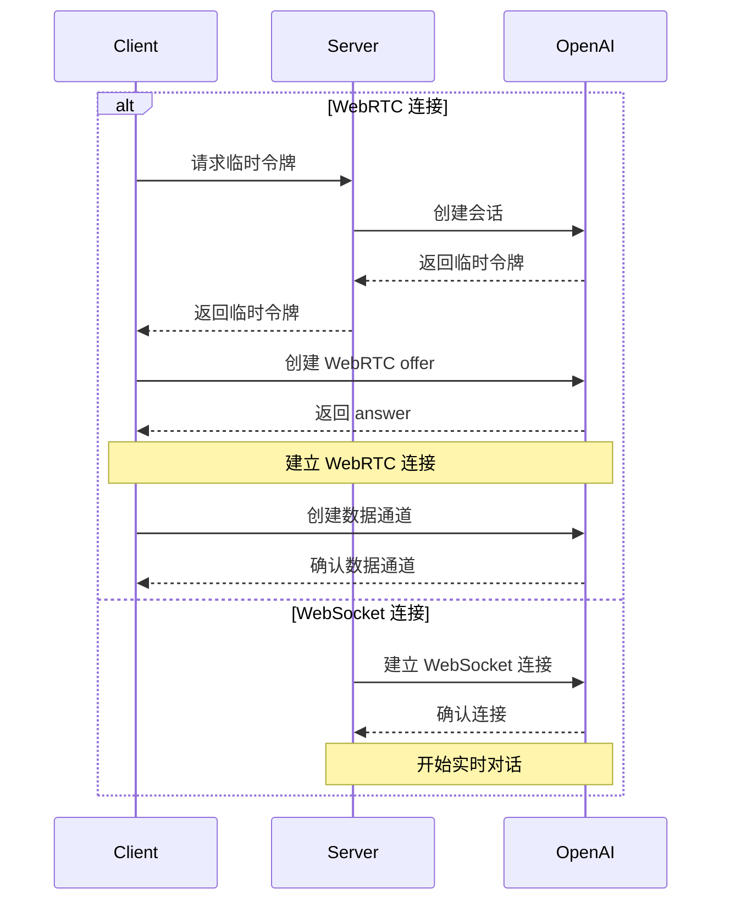

import { Callout } from 'fumadocs-ui/components/callout';

<Callout type="info" title="官方文档">
- [OpenAI Realtime WebRTC](https://platform.openai.com/docs/guides/realtime-webrtc)
- [OpenAI Realtime WebSocket](https://platform.openai.com/docs/guides/realtime-websocket)
</Callout>
## 📝 概述

### 简介
OpenAI Realtime API 提供两种连接方式：

1. WebRTC - 适用于浏览器和移动客户端的实时音视频交互

2. WebSocket - 适用于服务器到服务器的应用程序集成

### 使用场景
- 实时语音对话
- 音视频会议
- 实时翻译
- 语音转写
- 实时代码生成
- 服务器端实时集成

### 主要特性
- 双向音频流传输
- 文本和音频混合对话
- 函数调用支持
- 自动语音检测(VAD)
- 音频转写功能
- WebSocket 服务器端集成

## 🤖 支持的模型

目前支持的模型包括：

| 模型 | 描述 |
| --- | --- |
| **gpt-4o-realtime-preview** | GPT-4o 实时对话模型 |
| **gpt-4o-realtime-preview-2024-12-17** | GPT-4o 实时对话模型（2024-12-17 版本） |
| **gpt-4o-mini-realtime-preview** | GPT-4o Mini 实时对话模型 |

## 🔐 认证与安全

### 认证方式
1. 标准 API 密钥 (仅服务器端使用)
2. 临时令牌 (客户端使用)

### 临时令牌
- 有效期: 1分钟
- 使用限制: 单个连接
- 获取方式: 通过服务器端 API 创建

```http
POST ((SITE_URL))/v1/realtime/sessions
Content-Type: application/json
Authorization: Bearer $API_KEY

{
  "model": "gpt-4o-realtime-preview-2024-12-17",
  "voice": "verse"
}
```

### 安全建议
- 永远不要在客户端暴露标准 API 密钥
- 使用 HTTPS/WSS 进行通信
- 实现适当的访问控制
- 监控异常活动

## 🔌 连接建立

### WebRTC 连接
- URL: `((SITE_URL))/v1/realtime`
- 查询参数: `model`
- 请求头: 
  - `Authorization: Bearer EPHEMERAL_KEY`
  - `Content-Type: application/sdp`

### WebSocket 连接
- URL: `wss://((SITE_HOST))/v1/realtime`
- 查询参数: `model`
- 请求头:
  - `Authorization: Bearer YOUR_API_KEY`
  - `OpenAI-Beta: realtime=v1`

### 连接流程



### 数据通道
- 名称: `oai-events`
- 用途: 事件传输
- 格式: JSON

### 音频流
- 输入: `addTrack()`
- 输出: `ontrack` 事件

## 💬 对话交互

### 对话模式
1. 纯文本对话
2. 语音对话
3. 混合对话

### 会话管理
- 创建会话
- 更新会话
- 结束会话
- 会话配置

### 事件类型
- 文本事件
- 音频事件
- 函数调用
- 状态更新
- 错误事件

## ⚙️ 配置选项

### 音频配置
- 输入格式
  - `pcm16`
  - `g711_ulaw`
  - `g711_alaw`
- 输出格式
  - `pcm16`
  - `g711_ulaw`
  - `g711_alaw`
- 语音类型
  - `alloy`
  - `echo`
  - `shimmer`

### 模型配置
- 温度
- 最大输出长度
- 系统提示词
- 工具配置

### VAD 配置
- 阈值
- 静音时长
- 前缀填充

## 💡 请求示例

### WebSocket 连接 ✅

<ExampleTabs items={["Node.js (ws模块)","Python (websocket-client)","浏览器 (标准WebSocket)","消息收发示例","WebSocket Python语音示例"]}>
<ExampleTab id="request-example-1">

```javascript
import WebSocket from "ws";

const url = "wss://((SITE_HOST))/v1/realtime?model=gpt-4o-realtime-preview-2024-12-17";
const ws = new WebSocket(url, {
  headers: {
    "Authorization": "Bearer " + process.env.API_KEY,
    "OpenAI-Beta": "realtime=v1",
  },
});

ws.on("open", function open() {
  console.log("Connected to server.");
});

ws.on("message", function incoming(message) {
  console.log(JSON.parse(message.toString()));
});
```

</ExampleTab>

<ExampleTab id="request-example-2">

```python
# 需要安装 websocket-client 库:
# pip install websocket-client

import os
import json
import websocket

API_KEY = os.environ.get("API_KEY")

url = "wss://((SITE_HOST))/v1/realtime?model=gpt-4o-realtime-preview-2024-12-17"
headers = [
    "Authorization: Bearer " + API_KEY,
    "OpenAI-Beta: realtime=v1"
]

def on_open(ws):
    print("Connected to server.")

def on_message(ws, message):
    data = json.loads(message)
    print("Received event:", json.dumps(data, indent=2))

ws = websocket.WebSocketApp(
    url,
    header=headers,
    on_open=on_open,
    on_message=on_message,
)

ws.run_forever()
```

</ExampleTab>

<ExampleTab id="request-example-3">

```javascript
/*
注意：在浏览器等客户端环境中，我们建议使用WebRTC。
但在Deno和Cloudflare Workers等类浏览器环境中，
也可以使用标准WebSocket接口。
*/

const ws = new WebSocket(
  "wss://((SITE_HOST))/v1/realtime?model=gpt-4o-realtime-preview-2024-12-17",
  [
    "realtime",
    // 认证
    "openai-insecure-api-key." + API_KEY, 
    // 可选
    "openai-organization." + OPENAI_ORG_ID,
    "openai-project." + OPENAI_PROJECT_ID,
    // Beta协议，必需
    "openai-beta.realtime-v1"
  ]
);

ws.on("open", function open() {
  console.log("Connected to server.");
});

ws.on("message", function incoming(message) {
  console.log(message.data);
});
```

</ExampleTab>

<ExampleTab id="request-example-4">


##### Node.js/浏览器
```javascript
// 接收服务器事件
ws.on("message", function incoming(message) {
  // 需要从JSON解析消息数据
  const serverEvent = JSON.parse(message.data)
  console.log(serverEvent);
});

// 发送事件，创建符合客户端事件格式的JSON数据结构
const event = {
  type: "response.create",
  response: {
    modalities: ["audio", "text"],
    instructions: "Give me a haiku about code.",
  }
};
ws.send(JSON.stringify(event));
```

##### Python
```python
# 发送客户端事件，将字典序列化为JSON
def on_open(ws):
    print("Connected to server.")
    
    event = {
        "type": "response.create",
        "response": {
            "modalities": ["text"],
            "instructions": "Please assist the user."
        }
    }
    ws.send(json.dumps(event))

# 接收消息需要从JSON解析消息负载
def on_message(ws, message):
    data = json.loads(message)
    print("Received event:", json.dumps(data, indent=2))
```

</ExampleTab>

<ExampleTab id="request-example-5">


##### 示例文档

这是一个Python版本的OpenAI Realtime WebSocket语音对话示例，支持实时语音输入和输出。

###### 功能特性

- 🎤 **实时语音录制**: 自动检测语音输入并发送到服务器
- 🔊 **实时音频播放**: 播放AI的语音响应
- 📝 **文本显示**: 同时显示AI的文本响应
- 🎯 **自动语音检测**: 使用服务器端VAD（语音活动检测）
- 🔄 **双向通信**: 支持连续对话

###### 环境要求

- Python 3.7+
- 麦克风和扬声器
- 稳定的网络连接

###### 安装依赖

```bash
pip install -r requirements.txt
```

系统依赖:
在Linux系统上，你可能需要安装额外的音频库：

```bash
# Ubuntu/Debian
sudo apt-get install portaudio19-dev python3-pyaudio

# CentOS/RHEL
sudo yum install portaudio-devel
```

###### 配置

在 `openai_realtime_client.py` 文件中，确保以下配置正确：

```python
WEBSOCKET_URL = "wss://((SITE_HOST))/v1/realtime"
API_KEY = "sk-QMA3eCob2EmDI2graXo4onUupApVnrk8wPXemJ7lSfK4QPa0"
MODEL = "gpt-4o-realtime-preview-2024-12-17"
```

###### 使用方法

1. **运行程序**:
   ```bash
   python openai_realtime_client.py
   ```

2. **开始对话**:
   - 程序启动后会自动开始录音
   - 对着麦克风说话
   - AI会实时响应你的语音

3. **停止程序**:
   - 按 `Ctrl+C` 停止程序

###### 技术细节

音频配置:
- **采样率**: 24kHz (OpenAI Realtime API要求)
- **格式**: PCM16
- **声道**: 单声道
- **编码**: Base64

WebSocket消息类型:
- `session.update`: 会话配置
- `input_audio_buffer.append`: 发送音频数据
- `input_audio_buffer.commit`: 提交音频缓冲区
- `response.audio.delta`: 接收音频响应
- `response.text.delta`: 接收文本响应

语音活动检测:
使用服务器端VAD配置：
- 阈值: 0.5
- 前缀填充: 300ms
- 静音持续时间: 500ms

###### 故障排除

常见问题:

1. **音频设备问题**:
   ```bash
   # 检查音频设备
   python -c "import pyaudio; p = pyaudio.PyAudio(); print([p.get_device_info_by_index(i) for i in range(p.get_device_count())])"
   ```

2. **权限问题**:
   - 确保程序有麦克风访问权限
   - Linux: 检查ALSA/PulseAudio配置

3. **网络连接问题**:
   - 检查WebSocket URL是否正确
   - 确保API密钥有效
   - 检查防火墙设置

调试模式:

启用详细日志：
```python
logging.basicConfig(level=logging.DEBUG)
```

###### 代码结构

```
├── openai_realtime_client.py  # 主程序文件
├── requirements.txt           # Python依赖
└── README.md                  # 说明文档
```

主要类和方法:

- `OpenAIRealtimeClient`: 主客户端类
  - `connect()`: 连接WebSocket
  - `start_audio_streams()`: 启动音频流
  - `start_recording()`: 开始录音
  - `handle_response()`: 处理响应
  - `start_conversation()`: 开始对话

###### 注意事项

1. **音频质量**: 确保在安静环境中使用以获得最佳效果
2. **网络延迟**: 实时对话对网络延迟敏感
3. **资源使用**: 长时间运行可能消耗较多CPU和内存
4. **API限制**: 注意OpenAI API的使用限制和费用

###### 许可证

本项目仅供学习和测试使用。请遵守OpenAI的使用条款。


##### 示例代码
```python
#!/usr/bin/env python3
"""
OpenAI Realtime WebSocket 语音示例
支持实时语音对话，包括音频录制、发送和播放
"""

import asyncio
import json
import base64
import websockets
import pyaudio
import wave
import threading
import time
from typing import Optional
import logging

# 配置日志
logging.basicConfig(
    level=logging.DEBUG,
    format='%(asctime)s - %(name)s - %(levelname)s - %(message)s',
    handlers=[
        logging.StreamHandler(),
        logging.FileHandler('websocket_debug.log', encoding='utf-8')
    ]
)
logger = logging.getLogger(__name__)

class OpenAIRealtimeClient:
    def __init__(self, 
                 websocket_url: str,
                 api_key: str,
                 model: str = "gpt-4o-realtime-preview-2024-12-17"):
        self.websocket_url = websocket_url
        self.api_key = api_key
        self.model = model
        self.websocket = None
        self.is_recording = False
        self.is_connected = False
        
        # 音频配置
        self.audio_format = pyaudio.paInt16
        self.channels = 1
        self.rate = 24000  # OpenAI Realtime API 要求的采样率
        self.chunk = 1024
        self.audio = pyaudio.PyAudio()
        
        # 音频流
        self.input_stream = None
        self.output_stream = None
        
    async def connect(self):
        """连接到WebSocket服务器"""
        headers = {
            "Authorization": f"Bearer {self.api_key}",
            "OpenAI-Beta": "realtime=v1"
        }
        
        logger.info("=" * 80)
        logger.info("🚀 开始WebSocket连接")
        logger.info("=" * 80)
        logger.info(f"连接URL: {self.websocket_url}")
        logger.info(f"API密钥: {self.api_key[:10]}...")
        logger.info(f"请求头: {json.dumps(headers, ensure_ascii=False, indent=2)}")
        
        try:
            self.websocket = await websockets.connect(
                self.websocket_url,
                additional_headers=headers
            )
            self.is_connected = True
            logger.info("✅ WebSocket连接成功")
            
            # 发送会话配置
            await self.send_session_config()
            
        except Exception as e:
            logger.error(f"❌ WebSocket连接失败: {e}")
            logger.error(f"错误类型: {type(e).__name__}")
            raise
    
    async def send_session_config(self):
        """发送会话配置"""
        config = {
            "type": "session.update",
            "session": {
                "modalities": ["text", "audio"],
                "instructions": "你是一个有用的AI助手，可以进行实时语音对话。",
                "voice": "alloy",
                "input_audio_format": "pcm16",
                "output_audio_format": "pcm16",
                "input_audio_transcription": {
                    "model": "whisper-1"
                },
                "turn_detection": {
                    "type": "server_vad",
                    "threshold": 0.5,
                    "prefix_padding_ms": 300,
                    "silence_duration_ms": 500
                },
                "tools": [],
                "tool_choice": "auto",
                "temperature": 0.8,
                "max_response_output_tokens": 4096
            }
        }
        
        config_json = json.dumps(config, ensure_ascii=False, indent=2)
        logger.info("=" * 60)
        logger.info("📤 发送会话配置:")
        logger.info(f"消息类型: {config['type']}")
        logger.info(f"配置内容:\n{config_json}")
        logger.info("=" * 60)
        
        await self.websocket.send(json.dumps(config))
        logger.info("✅ 会话配置已发送")
    
    def start_audio_streams(self):
        """启动音频输入和输出流"""
        try:
            # 输入流（麦克风）
            self.input_stream = self.audio.open(
                format=self.audio_format,
                channels=self.channels,
                rate=self.rate,
                input=True,
                frames_per_buffer=self.chunk
            )
            
            # 输出流（扬声器）
            self.output_stream = self.audio.open(
                format=self.audio_format,
                channels=self.channels,
                rate=self.rate,
                output=True,
                frames_per_buffer=self.chunk
            )
            
            logger.info("音频流已启动")
            
        except Exception as e:
            logger.error(f"启动音频流失败: {e}")
            raise
    
    def stop_audio_streams(self):
        """停止音频流"""
        if self.input_stream:
            self.input_stream.stop_stream()
            self.input_stream.close()
            self.input_stream = None
            
        if self.output_stream:
            self.output_stream.stop_stream()
            self.output_stream.close()
            self.output_stream = None
            
        logger.info("音频流已停止")
    
    async def start_recording(self):
        """开始录音并发送音频数据"""
        self.is_recording = True
        logger.info("开始录音...")
        
        try:
            while self.is_recording and self.is_connected:
                # 读取音频数据
                audio_data = self.input_stream.read(self.chunk, exception_on_overflow=False)
                
                # 将音频数据编码为base64
                audio_base64 = base64.b64encode(audio_data).decode('utf-8')
                
                # 发送音频数据
                message = {
                    "type": "input_audio_buffer.append",
                    "audio": audio_base64
                }
                
                # 记录音频数据发送（每10次记录一次，避免日志过多）
                if hasattr(self, '_audio_count'):
                    self._audio_count += 1
                else:
                    self._audio_count = 1
                
                if self._audio_count % 10 == 0:  # 每10次记录一次
                    logger.debug(f"🎤 发送音频数据 #{self._audio_count}: 长度={len(audio_base64)} 字符")
                
                await self.websocket.send(json.dumps(message))
                
                # 短暂延迟以避免过度发送
                await asyncio.sleep(0.01)
                
        except Exception as e:
            logger.error(f"录音过程中出错: {e}")
        finally:
            logger.info("录音已停止")
    
    async def stop_recording(self):
        """停止录音"""
        self.is_recording = False
        
        # 发送录音结束信号
        if self.websocket and self.is_connected:
            message = {
                "type": "input_audio_buffer.commit"
            }
            
            logger.info("=" * 60)
            logger.info("📤 发送录音结束信号:")
            logger.info(f"消息类型: {message['type']}")
            logger.info("=" * 60)
            
            await self.websocket.send(json.dumps(message))
            logger.info("✅ 录音结束信号已发送")
    
    async def handle_response(self):
        """处理WebSocket响应"""
        try:
            async for message in self.websocket:
                data = json.loads(message)
                message_type = data.get("type", "unknown")
                
                # 详细记录所有接收到的消息
                logger.info("=" * 60)
                logger.info("📥 收到WebSocket消息:")
                logger.info(f"消息类型: {message_type}")
                
                # 根据消息类型进行不同的处理
                if message_type == "response.audio.delta":
                    # 处理音频响应
                    audio_data = base64.b64decode(data.get("delta", ""))
                    logger.info(f"🎵 音频数据: 长度={len(audio_data)} 字节")
                    if audio_data and self.output_stream:
                        self.output_stream.write(audio_data)
                        logger.info("✅ 音频数据已播放")
                
                elif message_type == "response.text.delta":
                    # 处理文本响应
                    text = data.get("delta", "")
                    logger.info(f"💬 文本增量: '{text}'")
                    if text:
                        print(f"AI: {text}", end="", flush=True)
                
                elif message_type == "response.text.done":
                    # 文本响应完成
                    logger.info("✅ 文本响应完成")
                    print("\n")
                
                elif message_type == "response.audio.done":
                    # 音频响应完成
                    logger.info("✅ 音频响应完成")
                
                elif message_type == "error":
                    # 处理错误
                    error_info = data.get('error', {})
                    logger.error("❌ 服务器错误:")
                    logger.error(f"错误详情: {json.dumps(error_info, ensure_ascii=False, indent=2)}")
                
                elif message_type == "session.created":
                    # 会话创建成功
                    logger.info("✅ 会话已创建")
                
                elif message_type == "session.updated":
                    # 会话更新成功
                    logger.info("✅ 会话已更新")
                
                elif message_type == "conversation.item.created":
                    # 对话项目创建
                    logger.info("📝 对话项目已创建")
                
                elif message_type == "conversation.item.input_audio_buffer.speech_started":
                    # 语音开始
                    logger.info("🎤 语音开始检测")
                
                elif message_type == "conversation.item.input_audio_buffer.speech_stopped":
                    # 语音结束
                    logger.info("🔇 语音结束检测")
                
                elif message_type == "conversation.item.input_audio_buffer.committed":
                    # 音频缓冲区已提交
                    logger.info("📤 音频缓冲区已提交")
                
                else:
                    # 其他未知消息类型
                    logger.info(f"❓ 未知消息类型: {message_type}")
                
                # 记录完整的消息内容（除了音频数据，因为太长）
                if message_type != "response.audio.delta":
                    logger.info(f"完整消息内容:\n{json.dumps(data, ensure_ascii=False, indent=2)}")
                
                logger.info("=" * 60)
                    
        except websockets.exceptions.ConnectionClosed:
            logger.info("WebSocket连接已关闭")
            self.is_connected = False
        except Exception as e:
            logger.error(f"处理响应时出错: {e}")
            self.is_connected = False
    
    async def start_conversation(self):
        """开始对话"""
        try:
            # 启动音频流
            self.start_audio_streams()
            
            # 创建任务
            response_task = asyncio.create_task(self.handle_response())
            recording_task = asyncio.create_task(self.start_recording())
            
            logger.info("对话已开始，按 Ctrl+C 停止")
            
            # 等待任务完成
            await asyncio.gather(response_task, recording_task)
            
        except KeyboardInterrupt:
            logger.info("收到停止信号")
        except Exception as e:
            logger.error(f"对话过程中出错: {e}")
        finally:
            await self.cleanup()
    
    async def cleanup(self):
        """清理资源"""
        self.is_recording = False
        self.is_connected = False
        
        # 停止音频流
        self.stop_audio_streams()
        
        # 关闭WebSocket连接
        if self.websocket:
            await self.websocket.close()
            logger.info("WebSocket连接已关闭")
        
        # 终止PyAudio
        self.audio.terminate()
        logger.info("资源清理完成")
    
    async def run(self):
        """运行客户端"""
        try:
            await self.connect()
            await self.start_conversation()
        except Exception as e:
            logger.error(f"运行客户端时出错: {e}")
        finally:
            await self.cleanup()


async def main():
    """主函数"""
    # 配置参数
    WEBSOCKET_URL = "wss://((SITE_HOST))/v1/realtime?model=gpt-4o-realtime-preview-2024-12-17"
    API_KEY = "sk-EpnduEXFxjAt0AF55W08WBmzqZHlv9f4tmCDWd9TcJqBwVjV"
    MODEL = "gpt-4o-realtime-preview-2024-12-17"
    
    # 创建客户端
    client = OpenAIRealtimeClient(
        websocket_url=WEBSOCKET_URL,
        api_key=API_KEY,
        model=MODEL
    )
    
    # 运行客户端
    await client.run()


if __name__ == "__main__":
    print("OpenAI Realtime WebSocket 语音示例")
    print("=" * 50)
    print("功能说明:")
    print("- 实时语音对话")
    print("- 自动语音识别")
    print("- 文本和音频响应")
    print("- 按 Ctrl+C 停止")
    print("=" * 50)
    
    try:
        asyncio.run(main())
    except KeyboardInterrupt:
        print("\n程序已停止")
    except Exception as e:
        print(f"程序出错: {e}")

```

</ExampleTab>

</ExampleTabs>

## ⚠️ 错误处理

### 常见错误
1. 连接错误
   - 网络问题
   - 认证失败
   - 配置错误
2. 音频错误
   - 设备权限
   - 格式不支持
   - 编解码问题
3. 会话错误
   - 令牌过期
   - 会话超时
   - 并发限制

### 错误恢复
1. 自动重连
2. 会话恢复
3. 错误重试
4. 降级处理

## 📝 事件参考

### 通用请求头

所有事件都需要包含以下请求头:

| 请求头 | 类型 | 说明 | 示例值 |
|--------|------|------|---------|
| Authorization | 字符串 | 认证令牌 | Bearer $API_KEY |
| OpenAI-Beta | 字符串 | API 版本 | realtime=v1 |

### 客户端事件

#### session.update

更新会话的默认配置。

<ParameterTree>
  <ParameterField id="openai-realtime-table-event-id-1" name="event_id" type="字符串">

    客户端生成的事件标识符
    **必需:** 否
    **示例值/可选值:** event_123
  </ParameterField>
  <ParameterField id="openai-realtime-table-type-2" name="type" type="字符串">

    事件类型
    **必需:** 否
    **示例值/可选值:** session.update
  </ParameterField>
  <ParameterField id="openai-realtime-table-modalities-3" name="modalities" type="字符串数组">

    模型可以响应的模态类型
    **必需:** 否
    **示例值/可选值:** ["text", "audio"]
  </ParameterField>
  <ParameterField id="openai-realtime-table-instructions-4" name="instructions" type="字符串">

    预置到模型调用前的系统指令
    **必需:** 否
    **示例值/可选值:** "Your knowledge cutoff is 2023-10..."
  </ParameterField>
  <ParameterField id="openai-realtime-table-voice-5" name="voice" type="字符串">

    模型使用的语音类型
    **必需:** 否
    **示例值/可选值:** alloy、echo、shimmer
  </ParameterField>
  <ParameterField id="openai-realtime-table-input-audio-format-6" name="input_audio_format" type="字符串">

    输入音频格式
    **必需:** 否
    **示例值/可选值:** pcm16、g711_ulaw、g711_alaw
  </ParameterField>
  <ParameterField id="openai-realtime-table-output-audio-format-7" name="output_audio_format" type="字符串">

    输出音频格式
    **必需:** 否
    **示例值/可选值:** pcm16、g711_ulaw、g711_alaw
  </ParameterField>
  <ParameterField id="openai-realtime-nested-1-group-input-audio-transcription" name="input_audio_transcription" type="object">
    <ParameterChildren>
      <ParameterField id="openai-realtime-table-input-audio-transcription-model-8" name="model" type="字符串">

        用于转写的模型
        **必需:** 否
        **示例值/可选值:** whisper-1
      </ParameterField>
    </ParameterChildren>
  </ParameterField>
  <ParameterField id="openai-realtime-nested-1-group-turn-detection" name="turn_detection" type="object">
    <ParameterChildren>
      <ParameterField id="openai-realtime-table-turn-detection-type-9" name="type" type="字符串">

        语音检测类型
        **必需:** 否
        **示例值/可选值:** server_vad
      </ParameterField>
      <ParameterField id="openai-realtime-table-turn-detection-threshold-10" name="threshold" type="数字">

        VAD 激活阈值(0.0-1.0)
        **必需:** 否
        **示例值/可选值:** 0.8
      </ParameterField>
      <ParameterField id="openai-realtime-table-turn-detection-prefix-padding-ms-11" name="prefix_padding_ms" type="整数">

        语音开始前包含的音频时长
        **必需:** 否
        **示例值/可选值:** 500
      </ParameterField>
      <ParameterField id="openai-realtime-table-turn-detection-silence-duration-ms-12" name="silence_duration_ms" type="整数">

        检测语音停止的静音持续时间
        **必需:** 否
        **示例值/可选值:** 1000
      </ParameterField>
    </ParameterChildren>
  </ParameterField>
  <ParameterField id="openai-realtime-table-tools-13" name="tools" type="数组">

    模型可用的工具列表
    **必需:** 否
    **示例值/可选值:** []
  </ParameterField>
  <ParameterField id="openai-realtime-table-tool-choice-14" name="tool_choice" type="字符串">

    模型选择工具的方式
    **必需:** 否
    **示例值/可选值:** auto/none/required
  </ParameterField>
  <ParameterField id="openai-realtime-table-temperature-15" name="temperature" type="数字">

    模型采样温度
    **必需:** 否
    **示例值/可选值:** 0.8
  </ParameterField>
  <ParameterField id="openai-realtime-table-max-output-tokens-16" name="max_output_tokens" type="字符串/整数">

    单次响应最大token数
    **必需:** 否
    **示例值/可选值:** "inf"/4096
  </ParameterField>
</ParameterTree>

#### input_audio_buffer.append

向输入音频缓冲区追加音频数据。

<ParameterTree>
  <ParameterField id="openai-realtime-table-event-id-17" name="event_id" type="字符串">

    客户端生成的事件标识符
    **必需:** 否
    **示例值:** event_456
  </ParameterField>
  <ParameterField id="openai-realtime-table-type-18" name="type" type="字符串">

    事件类型
    **必需:** 否
    **示例值:** input_audio_buffer.append
  </ParameterField>
  <ParameterField id="openai-realtime-table-audio-19" name="audio" type="字符串">

    Base64编码的音频数据
    **必需:** 否
    **示例值:** Base64EncodedAudioData
  </ParameterField>
</ParameterTree>

#### input_audio_buffer.commit

将缓冲区中的音频数据提交为用户消息。

<ParameterTree>
  <ParameterField id="openai-realtime-table-event-id-20" name="event_id" type="字符串">

    客户端生成的事件标识符
    **必需:** 否
    **示例值:** event_789
  </ParameterField>
  <ParameterField id="openai-realtime-table-type-21" name="type" type="字符串">

    事件类型
    **必需:** 否
    **示例值:** input_audio_buffer.commit
  </ParameterField>
</ParameterTree>

#### input_audio_buffer.clear

清空输入音频缓冲区中的所有音频数据。

<ParameterTree>
  <ParameterField id="openai-realtime-table-event-id-22" name="event_id" type="字符串">

    客户端生成的事件标识符
    **必需:** 否
    **示例值:** event_012
  </ParameterField>
  <ParameterField id="openai-realtime-table-type-23" name="type" type="字符串">

    事件类型
    **必需:** 否
    **示例值:** input_audio_buffer.clear
  </ParameterField>
</ParameterTree>

#### conversation.item.create

向对话中添加新的对话项。

<ParameterTree>
  <ParameterField id="openai-realtime-table-event-id-24" name="event_id" type="字符串">

    客户端生成的事件标识符
    **必需:** 否
    **示例值:** event_345
  </ParameterField>
  <ParameterField id="openai-realtime-table-type-25" name="type" type="字符串">

    事件类型
    **必需:** 否
    **示例值:** conversation.item.create
  </ParameterField>
  <ParameterField id="openai-realtime-table-previous-item-id-26" name="previous_item_id" type="字符串">

    新对话项将插入在此ID之后
    **必需:** 否
    **示例值:** null
  </ParameterField>
  <ParameterField id="openai-realtime-nested-5-group-item" name="item" type="object">
    <ParameterChildren>
      <ParameterField id="openai-realtime-table-item-id-27" name="id" type="字符串">

        对话项的唯一标识符
        **必需:** 否
        **示例值:** msg_001
      </ParameterField>
      <ParameterField id="openai-realtime-table-item-type-28" name="type" type="字符串">

        对话项类型
        **必需:** 否
        **示例值:** message/function_call/function_call_output
      </ParameterField>
      <ParameterField id="openai-realtime-table-item-status-29" name="status" type="字符串">

        对话项状态
        **必需:** 否
        **示例值:** completed/in_progress/incomplete
      </ParameterField>
      <ParameterField id="openai-realtime-table-item-role-30" name="role" type="字符串">

        消息发送者的角色
        **必需:** 否
        **示例值:** user/assistant/system
      </ParameterField>
      <ParameterField id="openai-realtime-table-item-content-31" name="content" type="数组">

        消息内容
        **必需:** 否
        **示例值:** [text/audio/transcript]
      </ParameterField>
      <ParameterField id="openai-realtime-table-item-call-id-32" name="call_id" type="字符串">

        函数调用的ID
        **必需:** 否
        **示例值:** call_001
      </ParameterField>
      <ParameterField id="openai-realtime-table-item-name-33" name="name" type="字符串">

        被调用的函数名称
        **必需:** 否
        **示例值:** function_name
      </ParameterField>
      <ParameterField id="openai-realtime-table-item-arguments-34" name="arguments" type="字符串">

        函数调用的参数
        **必需:** 否
        **示例值:** \{"param": "value"\}
      </ParameterField>
      <ParameterField id="openai-realtime-table-item-output-35" name="output" type="字符串">

        函数调用的输出结果
        **必需:** 否
        **示例值:** \{"result": "value"\}
      </ParameterField>
    </ParameterChildren>
  </ParameterField>
</ParameterTree>

#### conversation.item.truncate

截断助手消息中的音频内容。

<ParameterTree>
  <ParameterField id="openai-realtime-table-event-id-36" name="event_id" type="字符串">

    客户端生成的事件标识符
    **必需:** 否
    **示例值:** event_678
  </ParameterField>
  <ParameterField id="openai-realtime-table-type-37" name="type" type="字符串">

    事件类型
    **必需:** 否
    **示例值:** conversation.item.truncate
  </ParameterField>
  <ParameterField id="openai-realtime-table-item-id-38" name="item_id" type="字符串">

    要截断的助手消息项的ID
    **必需:** 否
    **示例值:** msg_002
  </ParameterField>
  <ParameterField id="openai-realtime-table-content-index-39" name="content_index" type="整数">

    要截断的内容部分的索引
    **必需:** 否
    **示例值:** 0
  </ParameterField>
  <ParameterField id="openai-realtime-table-audio-end-ms-40" name="audio_end_ms" type="整数">

    音频截断的结束时间点
    **必需:** 否
    **示例值:** 1500
  </ParameterField>
</ParameterTree>

#### conversation.item.delete

从对话历史中删除指定的对话项。

<ParameterTree>
  <ParameterField id="openai-realtime-table-event-id-41" name="event_id" type="字符串">

    客户端生成的事件标识符
    **必需:** 否
    **示例值:** event_901
  </ParameterField>
  <ParameterField id="openai-realtime-table-type-42" name="type" type="字符串">

    事件类型
    **必需:** 否
    **示例值:** conversation.item.delete
  </ParameterField>
  <ParameterField id="openai-realtime-table-item-id-43" name="item_id" type="字符串">

    要删除的对话项的ID
    **必需:** 否
    **示例值:** msg_003
  </ParameterField>
</ParameterTree>

#### response.create

触发响应生成。

<ParameterTree>
  <ParameterField id="openai-realtime-table-event-id-44" name="event_id" type="字符串">

    客户端生成的事件标识符
    **必需:** 否
    **示例值:** event_234
  </ParameterField>
  <ParameterField id="openai-realtime-table-type-45" name="type" type="字符串">

    事件类型
    **必需:** 否
    **示例值:** response.create
  </ParameterField>
  <ParameterField id="openai-realtime-nested-8-group-response" name="response" type="object">
    <ParameterChildren>
      <ParameterField id="openai-realtime-table-response-modalities-46" name="modalities" type="字符串数组">

        响应的模态类型
        **必需:** 否
        **示例值:** ["text", "audio"]
      </ParameterField>
      <ParameterField id="openai-realtime-table-response-instructions-47" name="instructions" type="字符串">

        给模型的指令
        **必需:** 否
        **示例值:** "Please assist the user."
      </ParameterField>
      <ParameterField id="openai-realtime-table-response-voice-48" name="voice" type="字符串">

        模型使用的语音类型
        **必需:** 否
        **示例值:** alloy/echo/shimmer
      </ParameterField>
      <ParameterField id="openai-realtime-table-response-output-audio-format-49" name="output_audio_format" type="字符串">

        输出音频格式
        **必需:** 否
        **示例值:** pcm16
      </ParameterField>
      <ParameterField id="openai-realtime-table-response-tools-50" name="tools" type="数组">

        模型可用的工具列表
        **必需:** 否
        **示例值:** ["type", "name", "description"]
      </ParameterField>
      <ParameterField id="openai-realtime-table-response-tool-choice-51" name="tool_choice" type="字符串">

        模型选择工具的方式
        **必需:** 否
        **示例值:** auto
      </ParameterField>
      <ParameterField id="openai-realtime-table-response-temperature-52" name="temperature" type="数字">

        采样温度
        **必需:** 否
        **示例值:** 0.7
      </ParameterField>
      <ParameterField id="openai-realtime-table-response-max-output-tokens-53" name="max_output_tokens" type="整数/字符串">

        最大输出token数
        **必需:** 否
        **示例值:** 150/"inf"
      </ParameterField>
    </ParameterChildren>
  </ParameterField>
</ParameterTree>

#### response.cancel

取消正在进行中的响应生成。

<ParameterTree>
  <ParameterField id="openai-realtime-table-event-id-54" name="event_id" type="字符串">

    客户端生成的事件标识符
    **必需:** 否
    **示例值:** event_567
  </ParameterField>
  <ParameterField id="openai-realtime-table-type-55" name="type" type="字符串">

    事件类型
    **必需:** 否
    **示例值:** response.cancel
  </ParameterField>
</ParameterTree>

### 服务端事件

#### error

当发生错误时返回的事件。

<ParameterTree>
  <ParameterField id="openai-realtime-table-event-id-56" name="event_id" type="字符串数组">

    服务端事件的唯一标识符
    **必需:** 否
    **示例值:** ["event_890"]
  </ParameterField>
  <ParameterField id="openai-realtime-table-type-57" name="type" type="字符串">

    事件类型
    **必需:** 否
    **示例值:** error
  </ParameterField>
  <ParameterField id="openai-realtime-nested-10-group-error" name="error" type="object">
    <ParameterChildren>
      <ParameterField id="openai-realtime-table-error-type-58" name="type" type="字符串">

        错误类型
        **必需:** 否
        **示例值:** invalid_request_error/server_error
      </ParameterField>
      <ParameterField id="openai-realtime-table-error-code-59" name="code" type="字符串">

        错误代码
        **必需:** 否
        **示例值:** invalid_event
      </ParameterField>
      <ParameterField id="openai-realtime-table-error-message-60" name="message" type="字符串">

        人类可读的错误消息
        **必需:** 否
        **示例值:** "The 'type' field is missing."
      </ParameterField>
      <ParameterField id="openai-realtime-table-error-param-61" name="param" type="字符串">

        与错误相关的参数
        **必需:** 否
        **示例值:** null
      </ParameterField>
      <ParameterField id="openai-realtime-table-error-event-id-62" name="event_id" type="字符串">

        相关事件的ID
        **必需:** 否
        **示例值:** event_567
      </ParameterField>
    </ParameterChildren>
  </ParameterField>
</ParameterTree>

#### conversation.item.input_audio_transcription.completed

当启用输入音频转写功能并且转写成功时返回此事件。

<ParameterTree>
  <ParameterField id="openai-realtime-table-event-id-63" name="event_id" type="字符串">

    服务端事件的唯一标识符
    **必需:** 否
    **示例值:** event_2122
  </ParameterField>
  <ParameterField id="openai-realtime-table-type-64" name="type" type="字符串">

    事件类型
    **必需:** 否
    **示例值:** conversation.item.input_audio_transcription.completed
  </ParameterField>
  <ParameterField id="openai-realtime-table-item-id-65" name="item_id" type="字符串">

    用户消息项的ID
    **必需:** 否
    **示例值:** msg_003
  </ParameterField>
  <ParameterField id="openai-realtime-table-content-index-66" name="content_index" type="整数">

    包含音频的内容部分的索引
    **必需:** 否
    **示例值:** 0
  </ParameterField>
  <ParameterField id="openai-realtime-table-transcript-67" name="transcript" type="字符串">

    转写的文本内容
    **必需:** 否
    **示例值:** "Hello, how are you?"
  </ParameterField>
</ParameterTree>

#### conversation.item.input_audio_transcription.failed

当配置了输入音频转写功能,但用户消息的转写请求失败时返回此事件。

<ParameterTree>
  <ParameterField id="openai-realtime-table-event-id-68" name="event_id" type="字符串">

    服务端事件的唯一标识符
    **必需:** 否
    **示例值:** event_2324
  </ParameterField>
  <ParameterField id="openai-realtime-table-type-69" name="type" type="字符串数组">

    事件类型
    **必需:** 否
    **示例值:** ["conversation.item.input_audio_transcription.failed"]
  </ParameterField>
  <ParameterField id="openai-realtime-table-item-id-70" name="item_id" type="字符串">

    用户消息项的ID
    **必需:** 否
    **示例值:** msg_003
  </ParameterField>
  <ParameterField id="openai-realtime-table-content-index-71" name="content_index" type="整数">

    包含音频的内容部分的索引
    **必需:** 否
    **示例值:** 0
  </ParameterField>
  <ParameterField id="openai-realtime-nested-12-group-error" name="error" type="object">
    <ParameterChildren>
      <ParameterField id="openai-realtime-table-error-type-72" name="type" type="字符串">

        错误类型
        **必需:** 否
        **示例值:** transcription_error
      </ParameterField>
      <ParameterField id="openai-realtime-table-error-code-73" name="code" type="字符串">

        错误代码
        **必需:** 否
        **示例值:** audio_unintelligible
      </ParameterField>
      <ParameterField id="openai-realtime-table-error-message-74" name="message" type="字符串">

        人类可读的错误消息
        **必需:** 否
        **示例值:** "The audio could not be transcribed."
      </ParameterField>
      <ParameterField id="openai-realtime-table-error-param-75" name="param" type="字符串">

        与错误相关的参数
        **必需:** 否
        **示例值:** null
      </ParameterField>
    </ParameterChildren>
  </ParameterField>
</ParameterTree>

#### conversation.item.truncated

当客户端截断了之前的助手音频消息项时返回此事件。

<ParameterTree>
  <ParameterField id="openai-realtime-table-event-id-76" name="event_id" type="字符串">

    服务端事件的唯一标识符
    **必需:** 否
    **示例值:** event_2526
  </ParameterField>
  <ParameterField id="openai-realtime-table-type-77" name="type" type="字符串">

    事件类型
    **必需:** 否
    **示例值:** conversation.item.truncated
  </ParameterField>
  <ParameterField id="openai-realtime-table-item-id-78" name="item_id" type="字符串">

    被截断的助手消息项的ID
    **必需:** 否
    **示例值:** msg_004
  </ParameterField>
  <ParameterField id="openai-realtime-table-content-index-79" name="content_index" type="整数">

    被截断的内容部分的索引
    **必需:** 否
    **示例值:** 0
  </ParameterField>
  <ParameterField id="openai-realtime-table-audio-end-ms-80" name="audio_end_ms" type="整数">

    音频被截断的时间点(毫秒)
    **必需:** 否
    **示例值:** 1500
  </ParameterField>
</ParameterTree>

#### conversation.item.deleted

当对话中的某个项目被删除时返回此事件。

<ParameterTree>
  <ParameterField id="openai-realtime-table-event-id-81" name="event_id" type="字符串">

    服务端事件的唯一标识符
    **必需:** 否
    **示例值:** event_2728
  </ParameterField>
  <ParameterField id="openai-realtime-table-type-82" name="type" type="字符串">

    事件类型
    **必需:** 否
    **示例值:** conversation.item.deleted
  </ParameterField>
  <ParameterField id="openai-realtime-table-item-id-83" name="item_id" type="字符串">

    被删除的对话项的ID
    **必需:** 否
    **示例值:** msg_005
  </ParameterField>
</ParameterTree>

#### input_audio_buffer.committed

当音频缓冲区中的数据被提交时返回此事件。

<ParameterTree>
  <ParameterField id="openai-realtime-table-event-id-84" name="event_id" type="字符串">

    服务端事件的唯一标识符
    **必需:** 否
    **示例值:** event_1121
  </ParameterField>
  <ParameterField id="openai-realtime-table-type-85" name="type" type="字符串">

    事件类型
    **必需:** 否
    **示例值:** input_audio_buffer.committed
  </ParameterField>
  <ParameterField id="openai-realtime-table-previous-item-id-86" name="previous_item_id" type="字符串">

    新对话项将插入在此ID对应的对话项之后
    **必需:** 否
    **示例值:** msg_001
  </ParameterField>
  <ParameterField id="openai-realtime-table-item-id-87" name="item_id" type="字符串">

    将要创建的用户消息项的ID
    **必需:** 否
    **示例值:** msg_002
  </ParameterField>
</ParameterTree>

#### input_audio_buffer.cleared

当客户端清空输入音频缓冲区时返回此事件。

<ParameterTree>
  <ParameterField id="openai-realtime-table-event-id-88" name="event_id" type="字符串">

    服务端事件的唯一标识符
    **必需:** 否
    **示例值:** event_1314
  </ParameterField>
  <ParameterField id="openai-realtime-table-type-89" name="type" type="字符串">

    事件类型
    **必需:** 否
    **示例值:** input_audio_buffer.cleared
  </ParameterField>
</ParameterTree>

#### input_audio_buffer.speech_started

在服务器语音检测模式下，当检测到语音输入时返回此事件。

<ParameterTree>
  <ParameterField id="openai-realtime-table-event-id-90" name="event_id" type="字符串">

    服务端事件的唯一标识符
    **必需:** 否
    **示例值:** event_1516
  </ParameterField>
  <ParameterField id="openai-realtime-table-type-91" name="type" type="字符串">

    事件类型
    **必需:** 否
    **示例值:** input_audio_buffer.speech_started
  </ParameterField>
  <ParameterField id="openai-realtime-table-audio-start-ms-92" name="audio_start_ms" type="整数">

    从会话开始到检测到语音的毫秒数
    **必需:** 否
    **示例值:** 1000
  </ParameterField>
  <ParameterField id="openai-realtime-table-item-id-93" name="item_id" type="字符串">

    语音停止时将创建的用户消息项的ID
    **必需:** 否
    **示例值:** msg_003
  </ParameterField>
</ParameterTree>

#### input_audio_buffer.speech_stopped

在服务器语音检测模式下，当检测到语音输入停止时返回此事件。

<ParameterTree>
  <ParameterField id="openai-realtime-table-event-id-94" name="event_id" type="字符串">

    服务端事件的唯一标识符
    **必需:** 否
    **示例值:** event_1718
  </ParameterField>
  <ParameterField id="openai-realtime-table-type-95" name="type" type="字符串">

    事件类型
    **必需:** 否
    **示例值:** input_audio_buffer.speech_stopped
  </ParameterField>
  <ParameterField id="openai-realtime-table-audio-start-ms-96" name="audio_start_ms" type="整数">

    从会话开始到检测到语音停止的毫秒数
    **必需:** 否
    **示例值:** 2000
  </ParameterField>
  <ParameterField id="openai-realtime-table-item-id-97" name="item_id" type="字符串">

    将要创建的用户消息项的ID
    **必需:** 否
    **示例值:** msg_003
  </ParameterField>
</ParameterTree>

#### response.created

当创建新的响应时返回此事件。

<ParameterTree>
  <ParameterField id="openai-realtime-table-event-id-98" name="event_id" type="字符串">

    服务端事件的唯一标识符
    **必需:** 否
    **示例值:** event_2930
  </ParameterField>
  <ParameterField id="openai-realtime-table-type-99" name="type" type="字符串">

    事件类型
    **必需:** 否
    **示例值:** response.created
  </ParameterField>
  <ParameterField id="openai-realtime-nested-19-group-response" name="response" type="object">
    <ParameterChildren>
      <ParameterField id="openai-realtime-table-response-id-100" name="id" type="字符串">

        响应的唯一标识符
        **必需:** 否
        **示例值:** resp_001
      </ParameterField>
      <ParameterField id="openai-realtime-table-response-object-101" name="object" type="字符串">

        对象类型
        **必需:** 否
        **示例值:** realtime.response
      </ParameterField>
      <ParameterField id="openai-realtime-table-response-status-102" name="status" type="字符串">

        响应的状态
        **必需:** 否
        **示例值:** in_progress
      </ParameterField>
      <ParameterField id="openai-realtime-table-response-status-details-103" name="status_details" type="对象">

        状态的附加详细信息
        **必需:** 否
        **示例值:** null
      </ParameterField>
      <ParameterField id="openai-realtime-table-response-output-104" name="output" type="字符串数组">

        响应生成的输出项列表
        **必需:** 否
        **示例值:** ["[]"]
      </ParameterField>
      <ParameterField id="openai-realtime-table-response-usage-105" name="usage" type="对象">

        响应的使用统计信息
        **必需:** 否
        **示例值:** null
      </ParameterField>
    </ParameterChildren>
  </ParameterField>
</ParameterTree>

#### response.done

当响应完成流式传输时返回此事件。

<ParameterTree>
  <ParameterField id="openai-realtime-table-event-id-106" name="event_id" type="字符串">

    服务端事件的唯一标识符
    **必需:** 否
    **示例值:** event_3132
  </ParameterField>
  <ParameterField id="openai-realtime-table-type-107" name="type" type="字符串">

    事件类型
    **必需:** 否
    **示例值:** response.done
  </ParameterField>
  <ParameterField id="openai-realtime-nested-20-group-response" name="response" type="object">
    <ParameterChildren>
      <ParameterField id="openai-realtime-table-response-id-108" name="id" type="字符串">

        响应的唯一标识符
        **必需:** 否
        **示例值:** resp_001
      </ParameterField>
      <ParameterField id="openai-realtime-table-response-object-109" name="object" type="字符串">

        对象类型
        **必需:** 否
        **示例值:** realtime.response
      </ParameterField>
      <ParameterField id="openai-realtime-table-response-status-110" name="status" type="字符串">

        响应的最终状态
        **必需:** 否
        **示例值:** completed/cancelled/failed/incomplete
      </ParameterField>
      <ParameterField id="openai-realtime-table-response-status-details-111" name="status_details" type="对象">

        状态的附加详细信息
        **必需:** 否
        **示例值:** null
      </ParameterField>
      <ParameterField id="openai-realtime-table-response-output-112" name="output" type="字符串数组">

        响应生成的输出项列表
        **必需:** 否
        **示例值:** ["[...]"]
      </ParameterField>
      <ParameterField id="openai-realtime-nested-20-group-usage" name="usage" type="object">
        <ParameterChildren>
          <ParameterField id="openai-realtime-table-response-usage-total-tokens-113" name="total_tokens" type="整数">

            总token数
            **必需:** 否
            **示例值:** 50
          </ParameterField>
          <ParameterField id="openai-realtime-table-response-usage-input-tokens-114" name="input_tokens" type="整数">

            输入token数
            **必需:** 否
            **示例值:** 20
          </ParameterField>
          <ParameterField id="openai-realtime-table-response-usage-output-tokens-115" name="output_tokens" type="整数">

            输出token数
            **必需:** 否
            **示例值:** 30
          </ParameterField>
        </ParameterChildren>
      </ParameterField>
    </ParameterChildren>
  </ParameterField>
</ParameterTree>

#### response.output_item.added

当响应生成过程中创建新的输出项时返回此事件。

<ParameterTree>
  <ParameterField id="openai-realtime-table-event-id-116" name="event_id" type="字符串">

    服务端事件的唯一标识符
    **必需:** 否
    **示例值:** event_3334
  </ParameterField>
  <ParameterField id="openai-realtime-table-type-117" name="type" type="字符串">

    事件类型
    **必需:** 否
    **示例值:** response.output_item.added
  </ParameterField>
  <ParameterField id="openai-realtime-table-response-id-118" name="response_id" type="字符串">

    输出项所属的响应ID
    **必需:** 否
    **示例值:** resp_001
  </ParameterField>
  <ParameterField id="openai-realtime-table-output-index-119" name="output_index" type="字符串">

    输出项在响应中的索引
    **必需:** 否
    **示例值:** 0
  </ParameterField>
  <ParameterField id="openai-realtime-nested-21-group-item" name="item" type="object">
    <ParameterChildren>
      <ParameterField id="openai-realtime-table-item-id-120" name="id" type="字符串">

        输出项的唯一标识符
        **必需:** 否
        **示例值:** msg_007
      </ParameterField>
      <ParameterField id="openai-realtime-table-item-object-121" name="object" type="字符串">

        对象类型
        **必需:** 否
        **示例值:** realtime.item
      </ParameterField>
      <ParameterField id="openai-realtime-table-item-type-122" name="type" type="字符串">

        输出项类型
        **必需:** 否
        **示例值:** message/function_call/function_call_output
      </ParameterField>
      <ParameterField id="openai-realtime-table-item-status-123" name="status" type="字符串">

        输出项状态
        **必需:** 否
        **示例值:** in_progress/completed
      </ParameterField>
      <ParameterField id="openai-realtime-table-item-role-124" name="role" type="字符串">

        与输出项关联的角色
        **必需:** 否
        **示例值:** assistant
      </ParameterField>
      <ParameterField id="openai-realtime-table-item-content-125" name="content" type="数组">

        输出项的内容
        **必需:** 否
        **示例值:** ["type", "text", "audio", "transcript"]
      </ParameterField>
    </ParameterChildren>
  </ParameterField>
</ParameterTree>

#### response.output_item.done

当输出项完成流式传输时返回此事件。

<ParameterTree>
  <ParameterField id="openai-realtime-table-event-id-126" name="event_id" type="字符串">

    服务端事件的唯一标识符
    **必需:** 否
    **示例值:** event_3536
  </ParameterField>
  <ParameterField id="openai-realtime-table-type-127" name="type" type="字符串">

    事件类型
    **必需:** 否
    **示例值:** response.output_item.done
  </ParameterField>
  <ParameterField id="openai-realtime-table-response-id-128" name="response_id" type="字符串">

    输出项所属的响应ID
    **必需:** 否
    **示例值:** resp_001
  </ParameterField>
  <ParameterField id="openai-realtime-table-output-index-129" name="output_index" type="字符串">

    输出项在响应中的索引
    **必需:** 否
    **示例值:** 0
  </ParameterField>
  <ParameterField id="openai-realtime-nested-22-group-item" name="item" type="object">
    <ParameterChildren>
      <ParameterField id="openai-realtime-table-item-id-130" name="id" type="字符串">

        输出项的唯一标识符
        **必需:** 否
        **示例值:** msg_007
      </ParameterField>
      <ParameterField id="openai-realtime-table-item-object-131" name="object" type="字符串">

        对象类型
        **必需:** 否
        **示例值:** realtime.item
      </ParameterField>
      <ParameterField id="openai-realtime-table-item-type-132" name="type" type="字符串">

        输出项类型
        **必需:** 否
        **示例值:** message/function_call/function_call_output
      </ParameterField>
      <ParameterField id="openai-realtime-table-item-status-133" name="status" type="字符串">

        输出项的最终状态
        **必需:** 否
        **示例值:** completed/incomplete
      </ParameterField>
      <ParameterField id="openai-realtime-table-item-role-134" name="role" type="字符串">

        与输出项关联的角色
        **必需:** 否
        **示例值:** assistant
      </ParameterField>
      <ParameterField id="openai-realtime-table-item-content-135" name="content" type="数组">

        输出项的内容
        **必需:** 否
        **示例值:** ["type", "text", "audio", "transcript"]
      </ParameterField>
    </ParameterChildren>
  </ParameterField>
</ParameterTree>

#### response.content_part.added

当响应生成过程中向助手消息项添加新的内容部分时返回此事件。

<ParameterTree>
  <ParameterField id="openai-realtime-table-event-id-136" name="event_id" type="字符串">

    服务端事件的唯一标识符
    **必需:** 否
    **示例值:** event_3738
  </ParameterField>
  <ParameterField id="openai-realtime-table-type-137" name="type" type="字符串">

    事件类型
    **必需:** 否
    **示例值:** response.content_part.added
  </ParameterField>
  <ParameterField id="openai-realtime-table-response-id-138" name="response_id" type="字符串">

    响应的ID
    **必需:** 否
    **示例值:** resp_001
  </ParameterField>
  <ParameterField id="openai-realtime-table-item-id-139" name="item_id" type="字符串">

    添加内容部分的消息项ID
    **必需:** 否
    **示例值:** msg_007
  </ParameterField>
  <ParameterField id="openai-realtime-table-output-index-140" name="output_index" type="整数">

    输出项在响应中的索引
    **必需:** 否
    **示例值:** 0
  </ParameterField>
  <ParameterField id="openai-realtime-table-content-index-141" name="content_index" type="整数">

    内容部分在消息项内容数组中的索引
    **必需:** 否
    **示例值:** 0
  </ParameterField>
  <ParameterField id="openai-realtime-nested-23-group-part" name="part" type="object">
    <ParameterChildren>
      <ParameterField id="openai-realtime-table-part-type-142" name="type" type="字符串">

        内容类型
        **必需:** 否
        **示例值:** text/audio
      </ParameterField>
      <ParameterField id="openai-realtime-table-part-text-143" name="text" type="字符串">

        文本内容
        **必需:** 否
        **示例值:** "Hello"
      </ParameterField>
      <ParameterField id="openai-realtime-table-part-audio-144" name="audio" type="字符串">

        Base64编码的音频数据
        **必需:** 否
        **示例值:** "base64_encoded_audio_data"
      </ParameterField>
      <ParameterField id="openai-realtime-table-part-transcript-145" name="transcript" type="字符串">

        音频的转写文本
        **必需:** 否
        **示例值:** "Hello"
      </ParameterField>
    </ParameterChildren>
  </ParameterField>
</ParameterTree>

#### response.content_part.done

当助手消息项中的内容部分完成流式传输时返回此事件。

<ParameterTree>
  <ParameterField id="openai-realtime-table-event-id-146" name="event_id" type="字符串">

    服务端事件的唯一标识符
    **必需:** 否
    **示例值:** event_3940
  </ParameterField>
  <ParameterField id="openai-realtime-table-type-147" name="type" type="字符串">

    事件类型
    **必需:** 否
    **示例值:** response.content_part.done
  </ParameterField>
  <ParameterField id="openai-realtime-table-response-id-148" name="response_id" type="字符串">

    响应的ID
    **必需:** 否
    **示例值:** resp_001
  </ParameterField>
  <ParameterField id="openai-realtime-table-item-id-149" name="item_id" type="字符串">

    添加内容部分的消息项ID
    **必需:** 否
    **示例值:** msg_007
  </ParameterField>
  <ParameterField id="openai-realtime-table-output-index-150" name="output_index" type="整数">

    输出项在响应中的索引
    **必需:** 否
    **示例值:** 0
  </ParameterField>
  <ParameterField id="openai-realtime-table-content-index-151" name="content_index" type="整数">

    内容部分在消息项内容数组中的索引
    **必需:** 否
    **示例值:** 0
  </ParameterField>
  <ParameterField id="openai-realtime-nested-24-group-part" name="part" type="object">
    <ParameterChildren>
      <ParameterField id="openai-realtime-table-part-type-152" name="type" type="字符串">

        内容类型
        **必需:** 否
        **示例值:** text/audio
      </ParameterField>
      <ParameterField id="openai-realtime-table-part-text-153" name="text" type="字符串">

        文本内容
        **必需:** 否
        **示例值:** "Hello"
      </ParameterField>
      <ParameterField id="openai-realtime-table-part-audio-154" name="audio" type="字符串">

        Base64编码的音频数据
        **必需:** 否
        **示例值:** "base64_encoded_audio_data"
      </ParameterField>
      <ParameterField id="openai-realtime-table-part-transcript-155" name="transcript" type="字符串">

        音频的转写文本
        **必需:** 否
        **示例值:** "Hello"
      </ParameterField>
    </ParameterChildren>
  </ParameterField>
</ParameterTree>

#### response.text.delta

当"text"类型内容部分的文本值更新时返回此事件。

<ParameterTree>
  <ParameterField id="openai-realtime-table-event-id-156" name="event_id" type="字符串">

    服务端事件的唯一标识符
    **必需:** 否
    **示例值:** event_4142
  </ParameterField>
  <ParameterField id="openai-realtime-table-type-157" name="type" type="字符串">

    事件类型
    **必需:** 否
    **示例值:** response.text.delta
  </ParameterField>
  <ParameterField id="openai-realtime-table-response-id-158" name="response_id" type="字符串">

    响应的ID
    **必需:** 否
    **示例值:** resp_001
  </ParameterField>
  <ParameterField id="openai-realtime-table-item-id-159" name="item_id" type="字符串">

    消息项的ID
    **必需:** 否
    **示例值:** msg_007
  </ParameterField>
  <ParameterField id="openai-realtime-table-output-index-160" name="output_index" type="整数">

    输出项在响应中的索引
    **必需:** 否
    **示例值:** 0
  </ParameterField>
  <ParameterField id="openai-realtime-table-content-index-161" name="content_index" type="整数">

    内容部分在消息项内容数组中的索引
    **必需:** 否
    **示例值:** 0
  </ParameterField>
  <ParameterField id="openai-realtime-table-delta-162" name="delta" type="字符串">

    文本增量更新内容
    **必需:** 否
    **示例值:** "Sure, I can h"
  </ParameterField>
</ParameterTree>

#### response.text.done

当"text"类型内容部分的文本流式传输完成时返回此事件。

<ParameterTree>
  <ParameterField id="openai-realtime-table-event-id-163" name="event_id" type="字符串">

    服务端事件的唯一标识符
    **必需:** 否
    **示例值:** event_4344
  </ParameterField>
  <ParameterField id="openai-realtime-table-type-164" name="type" type="字符串">

    事件类型
    **必需:** 否
    **示例值:** response.text.done
  </ParameterField>
  <ParameterField id="openai-realtime-table-response-id-165" name="response_id" type="字符串">

    响应的ID
    **必需:** 否
    **示例值:** resp_001
  </ParameterField>
  <ParameterField id="openai-realtime-table-item-id-166" name="item_id" type="字符串">

    消息项的ID
    **必需:** 否
    **示例值:** msg_007
  </ParameterField>
  <ParameterField id="openai-realtime-table-output-index-167" name="output_index" type="整数">

    输出项在响应中的索引
    **必需:** 否
    **示例值:** 0
  </ParameterField>
  <ParameterField id="openai-realtime-table-content-index-168" name="content_index" type="整数">

    内容部分在消息项内容数组中的索引
    **必需:** 否
    **示例值:** 0
  </ParameterField>
  <ParameterField id="openai-realtime-table-delta-169" name="delta" type="字符串">

    最终的完整文本内容
    **必需:** 否
    **示例值:** "Sure, I can help with that."
  </ParameterField>
</ParameterTree>

#### response.audio_transcript.delta

当模型生成的音频输出转写内容更新时返回此事件。

<ParameterTree>
  <ParameterField id="openai-realtime-table-event-id-170" name="event_id" type="字符串">

    服务端事件的唯一标识符
    **必需:** 否
    **示例值:** event_4546
  </ParameterField>
  <ParameterField id="openai-realtime-table-type-171" name="type" type="字符串">

    事件类型
    **必需:** 否
    **示例值:** response.audio_transcript.delta
  </ParameterField>
  <ParameterField id="openai-realtime-table-response-id-172" name="response_id" type="字符串">

    响应的ID
    **必需:** 否
    **示例值:** resp_001
  </ParameterField>
  <ParameterField id="openai-realtime-table-item-id-173" name="item_id" type="字符串">

    消息项的ID
    **必需:** 否
    **示例值:** msg_008
  </ParameterField>
  <ParameterField id="openai-realtime-table-output-index-174" name="output_index" type="整数">

    输出项在响应中的索引
    **必需:** 否
    **示例值:** 0
  </ParameterField>
  <ParameterField id="openai-realtime-table-content-index-175" name="content_index" type="整数">

    内容部分在消息项内容数组中的索引
    **必需:** 否
    **示例值:** 0
  </ParameterField>
  <ParameterField id="openai-realtime-table-delta-176" name="delta" type="字符串">

    转写文本的增量更新内容
    **必需:** 否
    **示例值:** "Hello, how can I a"
  </ParameterField>
</ParameterTree>

#### response.audio_transcript.done

当模型生成的音频输出转写完成流式传输时返回此事件。

<ParameterTree>
  <ParameterField id="openai-realtime-table-event-id-177" name="event_id" type="字符串">

    服务端事件的唯一标识符
    **必需:** 否
    **示例值:** event_4748
  </ParameterField>
  <ParameterField id="openai-realtime-table-type-178" name="type" type="字符串">

    事件类型
    **必需:** 否
    **示例值:** response.audio_transcript.done
  </ParameterField>
  <ParameterField id="openai-realtime-table-response-id-179" name="response_id" type="字符串">

    响应的ID
    **必需:** 否
    **示例值:** resp_001
  </ParameterField>
  <ParameterField id="openai-realtime-table-item-id-180" name="item_id" type="字符串">

    消息项的ID
    **必需:** 否
    **示例值:** msg_008
  </ParameterField>
  <ParameterField id="openai-realtime-table-output-index-181" name="output_index" type="整数">

    输出项在响应中的索引
    **必需:** 否
    **示例值:** 0
  </ParameterField>
  <ParameterField id="openai-realtime-table-content-index-182" name="content_index" type="整数">

    内容部分在消息项内容数组中的索引
    **必需:** 否
    **示例值:** 0
  </ParameterField>
  <ParameterField id="openai-realtime-table-transcript-183" name="transcript" type="字符串">

    音频的最终完整转写文本
    **必需:** 否
    **示例值:** "Hello, how can I assist you today?"
  </ParameterField>
</ParameterTree>

#### response.audio.delta

当模型生成的音频内容更新时返回此事件。

<ParameterTree>
  <ParameterField id="openai-realtime-table-event-id-184" name="event_id" type="字符串">

    服务端事件的唯一标识符
    **必需:** 否
    **示例值:** event_4950
  </ParameterField>
  <ParameterField id="openai-realtime-table-type-185" name="type" type="字符串">

    事件类型
    **必需:** 否
    **示例值:** response.audio.delta
  </ParameterField>
  <ParameterField id="openai-realtime-table-response-id-186" name="response_id" type="字符串">

    响应的ID
    **必需:** 否
    **示例值:** resp_001
  </ParameterField>
  <ParameterField id="openai-realtime-table-item-id-187" name="item_id" type="字符串">

    消息项的ID
    **必需:** 否
    **示例值:** msg_008
  </ParameterField>
  <ParameterField id="openai-realtime-table-output-index-188" name="output_index" type="整数">

    输出项在响应中的索引
    **必需:** 否
    **示例值:** 0
  </ParameterField>
  <ParameterField id="openai-realtime-table-content-index-189" name="content_index" type="整数">

    内容部分在消息项内容数组中的索引
    **必需:** 否
    **示例值:** 0
  </ParameterField>
  <ParameterField id="openai-realtime-table-delta-190" name="delta" type="字符串">

    Base64编码的音频数据增量
    **必需:** 否
    **示例值:** "Base64EncodedAudioDelta"
  </ParameterField>
</ParameterTree>

#### response.audio.done

当模型生成的音频完成时返回此事件。

<ParameterTree>
  <ParameterField id="openai-realtime-table-event-id-191" name="event_id" type="字符串">

    服务端事件的唯一标识符
    **必需:** 否
    **示例值:** event_5152
  </ParameterField>
  <ParameterField id="openai-realtime-table-type-192" name="type" type="字符串">

    事件类型
    **必需:** 否
    **示例值:** response.audio.done
  </ParameterField>
  <ParameterField id="openai-realtime-table-response-id-193" name="response_id" type="字符串">

    响应的ID
    **必需:** 否
    **示例值:** resp_001
  </ParameterField>
  <ParameterField id="openai-realtime-table-item-id-194" name="item_id" type="字符串">

    消息项的ID
    **必需:** 否
    **示例值:** msg_008
  </ParameterField>
  <ParameterField id="openai-realtime-table-output-index-195" name="output_index" type="整数">

    输出项在响应中的索引
    **必需:** 否
    **示例值:** 0
  </ParameterField>
  <ParameterField id="openai-realtime-table-content-index-196" name="content_index" type="整数">

    内容部分在消息项内容数组中的索引
    **必需:** 否
    **示例值:** 0
  </ParameterField>
</ParameterTree>

### 函数调用

#### response.function_call_arguments.delta

当模型生成的函数调用参数更新时返回此事件。

<ParameterTree>
  <ParameterField id="openai-realtime-table-event-id-197" name="event_id" type="字符串">

    服务端事件的唯一标识符
    **必需:** 否
    **示例值:** event_5354
  </ParameterField>
  <ParameterField id="openai-realtime-table-type-198" name="type" type="字符串">

    事件类型
    **必需:** 否
    **示例值:** response.function_call_arguments.delta
  </ParameterField>
  <ParameterField id="openai-realtime-table-response-id-199" name="response_id" type="字符串">

    响应的ID
    **必需:** 否
    **示例值:** resp_002
  </ParameterField>
  <ParameterField id="openai-realtime-table-item-id-200" name="item_id" type="字符串">

    消息项的ID
    **必需:** 否
    **示例值:** fc_001
  </ParameterField>
  <ParameterField id="openai-realtime-table-output-index-201" name="output_index" type="整数">

    输出项在响应中的索引
    **必需:** 否
    **示例值:** 0
  </ParameterField>
  <ParameterField id="openai-realtime-table-call-id-202" name="call_id" type="字符串">

    函数调用的ID
    **必需:** 否
    **示例值:** call_001
  </ParameterField>
  <ParameterField id="openai-realtime-table-delta-203" name="delta" type="字符串">

    JSON格式的函数调用参数增量
    **必需:** 否
    **示例值:** "\{\"location\": \"San\""
  </ParameterField>
</ParameterTree>

#### response.function_call_arguments.done

当模型生成的函数调用参数完成流式传输时返回此事件。

<ParameterTree>
  <ParameterField id="openai-realtime-table-event-id-204" name="event_id" type="字符串">

    服务端事件的唯一标识符
    **必需:** 否
    **示例值:** event_5556
  </ParameterField>
  <ParameterField id="openai-realtime-table-type-205" name="type" type="字符串">

    事件类型
    **必需:** 否
    **示例值:** response.function_call_arguments.done
  </ParameterField>
  <ParameterField id="openai-realtime-table-response-id-206" name="response_id" type="字符串">

    响应的ID
    **必需:** 否
    **示例值:** resp_002
  </ParameterField>
  <ParameterField id="openai-realtime-table-item-id-207" name="item_id" type="字符串">

    消息项的ID
    **必需:** 否
    **示例值:** fc_001
  </ParameterField>
  <ParameterField id="openai-realtime-table-output-index-208" name="output_index" type="整数">

    输出项在响应中的索引
    **必需:** 否
    **示例值:** 0
  </ParameterField>
  <ParameterField id="openai-realtime-table-call-id-209" name="call_id" type="字符串">

    函数调用的ID
    **必需:** 否
    **示例值:** call_001
  </ParameterField>
  <ParameterField id="openai-realtime-table-arguments-210" name="arguments" type="字符串">

    最终的完整函数调用参数(JSON格式)
    **必需:** 否
    **示例值:** "\{\"location\": \"San Francisco\"\}"
  </ParameterField>
</ParameterTree>

### 其他状态更新

#### rate_limits.updated

在每个 "response.done" 事件之后触发,用于指示更新后的速率限制。

<ParameterTree>
  <ParameterField id="openai-realtime-table-event-id-211" name="event_id" type="字符串">

    服务端事件的唯一标识符
    **必需:** 否
    **示例值:** event_5758
  </ParameterField>
  <ParameterField id="openai-realtime-table-type-212" name="type" type="字符串">

    事件类型
    **必需:** 否
    **示例值:** rate_limits.updated
  </ParameterField>
  <ParameterField id="openai-realtime-table-rate-limits-213" name="rate_limits" type="对象数组">

    速率限制信息列表
    **必需:** 否
    **示例值:** [\{"name": "requests_per_min", "limit": 60, "remaining": 45, "reset_seconds": 35\}]
  </ParameterField>
</ParameterTree>

#### conversation.created

当对话创建时返回此事件。

<ParameterTree>
  <ParameterField id="openai-realtime-table-event-id-214" name="event_id" type="字符串">

    服务端事件的唯一标识符
    **必需:** 否
    **示例值:** event_9101
  </ParameterField>
  <ParameterField id="openai-realtime-table-type-215" name="type" type="字符串">

    事件类型
    **必需:** 否
    **示例值:** conversation.created
  </ParameterField>
  <ParameterField id="openai-realtime-table-conversation-216" name="conversation" type="对象">

    对话资源对象
    **必需:** 否
    **示例值:** \{"id": "conv_001", "object": "realtime.conversation"\}
  </ParameterField>
</ParameterTree>

#### conversation.item.created

当对话项创建时返回此事件。

<ParameterTree>
  <ParameterField id="openai-realtime-table-event-id-217" name="event_id" type="字符串">

    服务端事件的唯一标识符
    **必需:** 否
    **示例值:** event_1920
  </ParameterField>
  <ParameterField id="openai-realtime-table-type-218" name="type" type="字符串">

    事件类型
    **必需:** 否
    **示例值:** conversation.item.created
  </ParameterField>
  <ParameterField id="openai-realtime-table-previous-item-id-219" name="previous_item_id" type="字符串">

    前一个对话项的ID
    **必需:** 否
    **示例值:** msg_002
  </ParameterField>
  <ParameterField id="openai-realtime-table-item-220" name="item" type="对象">

    对话项对象
    **必需:** 否
    **示例值:** \{"id": "msg_003", "object": "realtime.item", "type": "message", "status": "completed", "role": "user", "content": [\{"type": "text", "text": "Hello"\}]\}
  </ParameterField>
</ParameterTree>

#### session.created

当会话创建时返回此事件。

<ParameterTree>
  <ParameterField id="openai-realtime-table-event-id-221" name="event_id" type="字符串">

    服务端事件的唯一标识符
    **必需:** 否
    **示例值:** event_1234
  </ParameterField>
  <ParameterField id="openai-realtime-table-type-222" name="type" type="字符串">

    事件类型
    **必需:** 否
    **示例值:** session.created
  </ParameterField>
  <ParameterField id="openai-realtime-table-session-223" name="session" type="对象">

    会话对象
    **必需:** 否
    **示例值:** \{"id": "sess_001", "object": "realtime.session", "model": "gpt-4", "modalities": ["text", "audio"]\}
  </ParameterField>
</ParameterTree>

#### session.updated

当会话更新时返回此事件。

<ParameterTree>
  <ParameterField id="openai-realtime-table-event-id-224" name="event_id" type="字符串">

    服务端事件的唯一标识符
    **必需:** 否
    **示例值:** event_5678
  </ParameterField>
  <ParameterField id="openai-realtime-table-type-225" name="type" type="字符串">

    事件类型
    **必需:** 否
    **示例值:** session.updated
  </ParameterField>
  <ParameterField id="openai-realtime-table-session-226" name="session" type="对象">

    更新后的会话对象
    **必需:** 否
    **示例值:** \{"id": "sess_001", "object": "realtime.session", "model": "gpt-4", "modalities": ["text", "audio"]\}
  </ParameterField>
</ParameterTree>

### 速率限制事件参数表

<ParameterTree>
  <ParameterField id="openai-realtime-table-name-227" name="name" type="字符串">

    限制名称
    **必需:** 是
    **示例值:** requests_per_min
  </ParameterField>
  <ParameterField id="openai-realtime-table-limit-228" name="limit" type="整数">

    限制值
    **必需:** 是
    **示例值:** 60
  </ParameterField>
  <ParameterField id="openai-realtime-table-remaining-229" name="remaining" type="整数">

    剩余可用量
    **必需:** 是
    **示例值:** 45
  </ParameterField>
  <ParameterField id="openai-realtime-table-reset-seconds-230" name="reset_seconds" type="整数">

    重置时间(秒)
    **必需:** 是
    **示例值:** 35
  </ParameterField>
</ParameterTree>

### 函数调用参数表

<ParameterTree>
  <ParameterField id="openai-realtime-table-type-231" name="type" type="字符串">

    函数类型
    **必需:** 是
    **示例值:** function
  </ParameterField>
  <ParameterField id="openai-realtime-table-name-232" name="name" type="字符串">

    函数名称
    **必需:** 是
    **示例值:** get_weather
  </ParameterField>
  <ParameterField id="openai-realtime-table-description-233" name="description" type="字符串">

    函数描述
    **必需:** 否
    **示例值:** Get the current weather
  </ParameterField>
  <ParameterField id="openai-realtime-table-parameters-234" name="parameters" type="对象">

    函数参数定义
    **必需:** 是
    **示例值:** \{"type": "object", "properties": \{...\}\}
  </ParameterField>
</ParameterTree>

### 音频格式参数表

<ParameterTree>
  <ParameterField id="openai-realtime-table-sample-rate-235" name="sample_rate" type="整数">

    采样率
    **可选值:** 8000, 16000, 24000, 44100, 48000
  </ParameterField>
  <ParameterField id="openai-realtime-table-channels-236" name="channels" type="整数">

    声道数
    **可选值:** 1 (单声道), 2 (立体声)
  </ParameterField>
  <ParameterField id="openai-realtime-table-bits-per-sample-237" name="bits_per_sample" type="整数">

    采样位数
    **可选值:** 16 (pcm16), 8 (g711)
  </ParameterField>
  <ParameterField id="openai-realtime-table-encoding-238" name="encoding" type="字符串">

    编码方式
    **可选值:** pcm16, g711_ulaw, g711_alaw
  </ParameterField>
</ParameterTree>

### 语音检测参数表

<ParameterTree>
  <ParameterField id="openai-realtime-table-threshold-239" name="threshold" type="浮点数">

    VAD 激活阈值
    **默认值:** 0.5
    **范围:** 0.0-1.0
  </ParameterField>
  <ParameterField id="openai-realtime-table-prefix-padding-ms-240" name="prefix_padding_ms" type="整数">

    语音前缀填充(毫秒)
    **默认值:** 500
    **范围:** 0-5000
  </ParameterField>
  <ParameterField id="openai-realtime-table-silence-duration-ms-241" name="silence_duration_ms" type="整数">

    静音检测时长(毫秒)
    **默认值:** 1000
    **范围:** 100-10000
  </ParameterField>
</ParameterTree>

### 工具选择参数表

<ParameterTree>
  <ParameterField id="openai-realtime-table-tool-choice-242" name="tool_choice" type="字符串">

    工具选择方式
    **可选值:** auto, none, required
  </ParameterField>
  <ParameterField id="openai-realtime-table-tools-243" name="tools" type="数组">

    可用工具列表
    **可选值:** [\{type, name, description, parameters\}]
  </ParameterField>
</ParameterTree>

### 模型配置参数表

<ParameterTree>
  <ParameterField id="openai-realtime-table-temperature-244" name="temperature" type="浮点数">

    采样温度
    **范围/可选值:** 0.0-2.0
    **默认值:** 1.0
  </ParameterField>
  <ParameterField id="openai-realtime-table-max-output-tokens-245" name="max_output_tokens" type="整数/字符串">

    最大输出长度
    **范围/可选值:** 1-4096/"inf"
    **默认值:** "inf"
  </ParameterField>
  <ParameterField id="openai-realtime-table-modalities-246" name="modalities" type="字符串数组">

    响应模态
    **范围/可选值:** ["text", "audio"]
    **默认值:** ["text"]
  </ParameterField>
  <ParameterField id="openai-realtime-table-voice-247" name="voice" type="字符串">

    语音类型
    **范围/可选值:** alloy, echo, shimmer
    **默认值:** alloy
  </ParameterField>
</ParameterTree>

### 事件通用参数表

<ParameterTree>
  <ParameterField id="openai-realtime-table-event-id-248" name="event_id" type="字符串">

    事件的唯一标识符
    **必需:** 是
    **示例值:** event_123
  </ParameterField>
  <ParameterField id="openai-realtime-table-type-249" name="type" type="字符串">

    事件类型
    **必需:** 是
    **示例值:** session.update
  </ParameterField>
  <ParameterField id="openai-realtime-table-timestamp-250" name="timestamp" type="整数">

    事件发生的时间戳(毫秒)
    **必需:** 否
    **示例值:** 1677649363000
  </ParameterField>
</ParameterTree>

### 会话状态参数表

<ParameterTree>
  <ParameterField id="openai-realtime-table-status-251" name="status" type="字符串">

    会话状态
    **可选值:** active, ended, error
  </ParameterField>
  <ParameterField id="openai-realtime-table-error-252" name="error" type="对象">

    错误信息
    **可选值:** \{"type": "error_type", "message": "error message"\}
  </ParameterField>
  <ParameterField id="openai-realtime-table-metadata-253" name="metadata" type="对象">

    会话元数据
    **可选值:** \{"client_id": "web", "session_type": "chat"\}
  </ParameterField>
</ParameterTree>

### 对话项状态参数表

<ParameterTree>
  <ParameterField id="openai-realtime-table-status-254" name="status" type="字符串">

    对话项状态
    **可选值:** completed, in_progress, incomplete
  </ParameterField>
  <ParameterField id="openai-realtime-table-role-255" name="role" type="字符串">

    发送者角色
    **可选值:** user, assistant, system
  </ParameterField>
  <ParameterField id="openai-realtime-table-type-256" name="type" type="字符串">

    对话项类型
    **可选值:** message, function_call, function_call_output
  </ParameterField>
</ParameterTree>

### 内容类型参数表

<ParameterTree>
  <ParameterField id="openai-realtime-table-type-257" name="type" type="字符串">

    内容类型
    **可选值:** text, audio, transcript
  </ParameterField>
  <ParameterField id="openai-realtime-table-format-258" name="format" type="字符串">

    内容格式
    **可选值:** plain, markdown, html
  </ParameterField>
  <ParameterField id="openai-realtime-table-encoding-259" name="encoding" type="字符串">

    编码方式
    **可选值:** utf-8, base64
  </ParameterField>
</ParameterTree>

### 响应状态参数表

<ParameterTree>
  <ParameterField id="openai-realtime-table-status-260" name="status" type="字符串">

    响应状态
    **可选值:** completed, cancelled, failed, incomplete
  </ParameterField>
  <ParameterField id="openai-realtime-table-status-details-261" name="status_details" type="对象">

    状态详情
    **可选值:** \{"reason": "user_cancelled"\}
  </ParameterField>
  <ParameterField id="openai-realtime-table-usage-262" name="usage" type="对象">

    使用统计
    **可选值:** \{"total_tokens": 50, "input_tokens": 20, "output_tokens": 30\}
  </ParameterField>
</ParameterTree>

### 音频转写参数表

<ParameterTree>
  <ParameterField id="openai-realtime-table-enabled-263" name="enabled" type="布尔值">

    是否启用转写
    **示例值:** true
  </ParameterField>
  <ParameterField id="openai-realtime-table-model-264" name="model" type="字符串">

    转写模型
    **示例值:** whisper-1
  </ParameterField>
  <ParameterField id="openai-realtime-table-language-265" name="language" type="字符串">

    转写语言
    **示例值:** en, zh, auto
  </ParameterField>
  <ParameterField id="openai-realtime-table-prompt-266" name="prompt" type="字符串">

    转写提示词
    **示例值:** "Transcript of a conversation"
  </ParameterField>
</ParameterTree>

### 音频流参数表

<ParameterTree>
  <ParameterField id="openai-realtime-table-chunk-size-267" name="chunk_size" type="整数">

    音频块大小(字节)
    **可选值:** 1024, 2048, 4096
  </ParameterField>
  <ParameterField id="openai-realtime-table-latency-268" name="latency" type="字符串">

    延迟模式
    **可选值:** low, balanced, high
  </ParameterField>
  <ParameterField id="openai-realtime-table-compression-269" name="compression" type="字符串">

    压缩方式
    **可选值:** none, opus, mp3
  </ParameterField>
</ParameterTree>

### WebRTC 配置参数表

<ParameterTree>
  <ParameterField id="openai-realtime-table-ice-servers-270" name="ice_servers" type="数组">

    ICE 服务器列表
    **默认值:** [\{"urls": "stun:stun.l.google.com:19302"\}]
  </ParameterField>
  <ParameterField id="openai-realtime-table-audio-constraints-271" name="audio_constraints" type="对象">

    音频约束
    **默认值:** \{"echoCancellation": true\}
  </ParameterField>
  <ParameterField id="openai-realtime-table-connection-timeout-272" name="connection_timeout" type="整数">

    连接超时(毫秒)
    **默认值:** 30000
  </ParameterField>
</ParameterTree>
